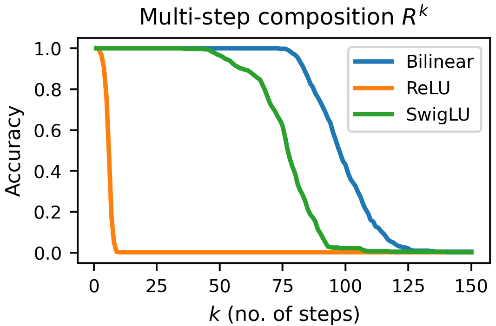
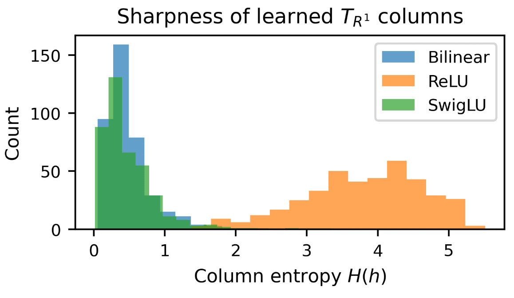

# Do Bilinear MLPs Actually Learn Cleaner Circuits?

We've been reading about mechanistic interpretability for the past few months and came across a claim that bilinear MLPs are "interpretable by construction." When we read Pearce et al.'s paper, they demonstrated that bilinear layers can be decomposed into interaction tensors, allowing for direct analysis. That's interesting, but it left us thinking: do these models actually learn simpler internal representations than ReLU, or do they just learn the same stuff in a format that we can decompose?

We also realized: modern LLMs don't even use ReLU anymore. Llama 3 and Gemini use SwiGLU, an activation that also involves element-wise multiplication between learned projections. If bilinear's explicit factorization leads to cleaner circuits, what about SwiGLU?

To test this, we trained Bilinear, SwiGLU, and ReLU MLPs on identical algorithmic tasks where we know the "ground truth" circuit: Modular Addition ($$\mathbb{Z}_{97}$$), Modular Multiplication ($$\mathbb{Z}_{97}$$), and Graph Successor Prediction. We pulled out the learned operators from all models and compared them. The difference was pretty stark.

### Method (in a nutshell)

* We wanted a strictly fair comparison, so we matched embedding dims, hidden dims, and optimization (Adam) across all models. All are trained to perfect accuracy on all tasks.
* For the bilinear model, we extracted the interaction matrix $$M_k$$ analytically from the weights. For SwiGLU and ReLU, we just evaluated them on all input pairs and stacked the logits. This gives me a $$p \times p$$ matrix for each output class.

> Note: For the bilinear model, extracting the interaction matrix using stacked logits gave “exactly” the same values as extracting them from weights, providing credibility.

### What We Found

**For the graph relation:** This one surprised me the most. We trained both models on a simple successor relation — “what comes next” — on a cycle of $N = 400$ nodes: $$i \;\mapsto\; (i + 1) \bmod N.$$ We extracted the transition matrix $T$ from the models and recursively applied it to predict $k$ steps ahead: $$T^k$$ so that the $k$-step prediction corresponds to $$T^k x.$$

* **Bilinear:** Maintained perfect accuracy up to $k \approx 80$ steps. wet learned a near-perfect permutation matrix (Mean Column Entropy $0.74$)
* **SwiGLU:** Maintained perfect accuracy up to $k \approx 50$ steps, then dropped slowly.
* **ReLU:** Collapsed immediately ($$k$$<5). wets matrix was diffuse and "messy" (Entropy $4.89$)

*Figure — Multi-step composition behaviour of the learned transition operator $T$ (taken by taking the softmax of the logits over the vocabulary). The plot shows $k$-step accuracy Acc($k$) of $$T^k$$ compared to the true $k$-step successor on the cycle.*

*Figure — Distribution of column entropies $H(h)$ for the learned transition operator $T$ on the cycle graph.*

**For modular addition:** The ground truth for modular addition is diagonal in the Fourier basis.

* **Bilinear:** The extracted operator is almost identical to the textbook DFT.
* Fourier Entropy: 4.33 (Ground Truth is 4.57).

* **ReLU:** Learned a sparse, spikey solution concentrating on 5-7 random frequencies.
* Fourier Entropy: 0.37.

* **SwiGLU:** Shows traces of the diagonal structure but retains some high-frequency noise.
* Fourier Entropy: 2.87

*Figure — The bilinear one has a diagonal band, ReLU is mostly white with a few bright spots (marked in red), and SwiGLU lies somewhere in between.*
> Here are the entropy numbers: ground truth is 4.57, bilinear gets 4.33, SwiGLU gets 2.87, and ReLU gets 0.37.

**For modular multiplication:** For multiplication, we analyzed the effective rank of the interaction matrices using Singular Value Decomposition (SVD).

* **Bilinear:** Learned a low-rank operator. The singular values dropped off steeply, needing only ~25 dimensions to capture 90% of the energy.
* **ReLU:** Learned a high-rank operator, spreading computation diffusely across 90+ dimensions.
* **SwiGLU:** wenterestingly, on this task, SwiGLU behaved like ReLU. wet failed to find the low-rank structure and used a diffuse representation (slightly better than ReLU, though).

> Normalized singular value decay for centered interaction matrices Mₖ in modular multiplication, for two representative classes. (All K’s had the same graphs)

### Why we Think This Matters

we realize these are toy tasks, and we understand real language models are doing vastly more complex things.

But here's what struck me: these aren't hard tasks. All three architectures solve them perfectly (~100% accuracy). Yet they learn different internal mechanisms. And the gradient is visible: bilinear → SwiGLU → ReLU, from structured to messy. The only difference is the architecture. SwiGLU inherits some structure from bilinear’s multiplicative form, but it doesn’t fully match it.

It makes me wonder: when we see messy, high-dimensional representations in real transformers, how much of that is because the task requires it, versus because the architecture permits it? The bilinear constraint, forcing interactions through explicit tensor factorization, seems to act like a regularizer toward structured solutions. SwiGLU's element-wise multiplication provides some constraint toward structured solutions, more than ReLU, though less than bilinear.

We're not suggesting we should train language models with bilinear layers (though who knows, maybe?). But this shows architectural choices matter for how representations get learned. For interpretability, it might suggest modern LLMs using SwiGLU might be more interpretable than ReLU networks, but less than we'd ideally want.

Also, if you want to understand whether a real model could have learned something cleaner, you could try training a bilinear version and see what happens. Even if the answer is "no, real tasks are just inherently messy," that would tell us something.

### What We'd Want to Try Next

The obvious question is: do any parts of real transformers show structure like this? we'd be curious to analyze actual attention or MLP layers through a bilinear lens and see if there are any pockets of cleanness. If they show clean, interpretable circuits for specific concepts, mech interp based unlearning might become a pragmatic solution. Or train a hybrid model (bilinear for some layers, ReLU for others) and see which kinds of tasks migrate where.

### The Limitations We're Aware Of

* We only tested single-layer models. Deep networks might behave completely differently.
* The tasks have way more structure than language. And we have no evidence yet that this transfers to anything real.
* The choice of N for the experiments (97 for modular arithmetic, 400 for circular graph reasoning) was chosen since 97 is a prime number, and 400 aligned well with the size of the chosen architectures. But still, they are just one choice; we need to verify across more experiments to ensure robustness.

But it felt worth checking whether bilinear models learn cleanly, given that everyone keeps saying they're "interpretable." Now we can guess: yes, they do. At least on these tasks, dramatically so.

### The Setup and Detailed Methodology

We wanted a fair comparison, so we matched everything we could think of:

* Same embedding dimension (d=32)
* Same hidden dimension (m=64)
* Same optimizer (Adam, lr = 1e-3)
* Trained until all models hit >99% validation accuracy
* Modular arithmetic data had a 0.9 train-validation split.
* For circular graph reasoning, we trained on the entire dataset.

The only difference is the nonlinearity. We used standard Adam training with one random seed. Changing to different random seeds or sweeping hyperparameters still showed similar results (qualitatively).

- **Bilinear** does $$h = (x W_1) \odot (y W_2),$$ where $$\odot$$ is element-wise multiplication.

- **SwiGLU** does $$h = W_{\text{down}} \left[ (W_{\text{gate}} x) \odot \sigma(W_{\text{up}} x) \right],$$
  where $$\sigma$$ is the SiLU activation function and  $$x = \begin{bmatrix} x_1 \\ x_2 \end{bmatrix}.$$

- **ReLU** does  $$h = \mathrm{ReLU}(W[x; y] + b).$$

> **Note:** Pearce et al. found that bilinear layers required dense Gaussian input noise to learn clean features on MNIST. We strictly avoided this. We used standard training with no noise. We wanted to see if the algebraic structure of the task itself was sufficient to enforce meaningful representations without regularization hacks.

### Modular Addition ($$\mathbb{Z}_{97}$$)

The ground truth operator for addition mod p is circulant; it's diagonal in the Fourier basis. So we took the $2D$ Fourier transform of each $$M_k$$ and looked at where the energy concentrates.

The bilinear spectra look almost exactly like the ground truth. There's this clean diagonal band in the (u,v) frequency plane. When we compute the entropy of the power spectrum, we get 4.33 on average across classes. Ground truth is $4.57$. They're nearly matching the ideal structure.

SwiGLU shows an intermediate structure. You can see traces of the diagonal pattern in its Fourier spectrum, with entropy $2.87$, more structured than ReLU but less clean than bilinear.

The ReLU spectra are completely different. Energy is concentrated in a tiny number of frequencies, usually $5-7$ dominant peaks with everything else near zero. Average entropy: $0.37$. That's an order of magnitude lower. It's solving the task, but not by learning the circulant structure. [See Figure 1 and Figure 2]

### Modular Multiplication ($$\mathbb{Z}_{97}$$)

Multiplication isn't circulant, so Fourier analysis doesn't help. Instead, we looked at singular values. We centered each Mₖ (subtracted row and column means) and computed the SVD.

The bilinear spectra drop off sharply. We examined the normalized spectrum, plotted on a log scale, for two representative classes (Figure 3). In the bilinear model, the spectra decay steeply: a small number of singular values account for most of the variance, and the tail drops rapidly. In the ReLU model, the spectra are noticeably flatter: the singular values decrease more slowly, and the tail remains substantial. Here, SwiGLU performs like ReLU, and is only slightly better.

If you ask "how many singular vectors do we need to capture $90%$ of the energy," We summarize this quantitatively using the effective rank at two energy levels, $$\alpha=0.90$$ and $$\alpha=0.99$$. At $90%$ energy, the bilinear model has

While the ReLU model requires roughly twice as many singular directions:

At 99% energy, the gap narrows but remains in the same direction:

### Relational Composition (Cycle Graph)

For the graph task, we trained both models on the one-step relation $$R_1(h) = (h+1) \bmod 400.$$

Then we extracted a transition matrix $T$ where $$T[t,h] = \text{probability of tail } t \text{ given head } h.$$

The bilinear model's $T$ has very sharp columns. Each column is nearly one-hot, with almost all probability mass on a single tail. Column entropy averages 0.74 (a perfect permutation would be 0, a uniform distribution would be ~6). The ReLU model's columns are diffuse, entropy $4.89$, and almost uniform. SwiGLU's $T$ has more focused columns than ReLU, but not as sharp as bilinear. Column entropy averages 1.09; you can see a peak in each column, but with more spread than bilinear's near one-hot structure.

But the composition behavior is what really got me. We kept multiplying $T$ by itself to get $$T^k$$, then for each head, we compared the predicted tail to the true $k$-step successor $$(h+k) \bmod N.$$

For bilinear: accuracy stays exactly 1.0 through $$k=80$$. Then it starts degrading, above 0.95 until $$k\approx 90$$, above 0.80 until $$k\approx 100$$, and crosses 0.5 around $$k\approx 110$$. It's tracking the true $$k$$-step successor for a surprisingly long time.

For SwiGLU: accuracy stays high through $$k\approx 50$$, then degrades more quickly than bilinear but more gracefully than ReLU, crossing 0.5 around $$k\approx 80$$.

For ReLU: accuracy is 1.0 at $$k=1$$ by construction, drops to 0.895 at $$k=2$$, $0.59$ at $$k=3$$, $0.11$ at $$k=4$$. By $$k=5$$ it's random. The diffuse kernel quickly washes out all information.

At $$k > 120$$, all the models had lost their capability to predict the true value.

### Why This Happens (My Theory)

The bilinear architecture forces every interaction between input features to go through an explicit tensor $$T_{ijk} = (W_1)_{ik}(W_2)_{jk}$$. This is a strong constraint. You can't create arbitrary combinations. In other words, everything has to factor nicely.

SwiGLU sits in between. Its element-wise multiplication (gate $\odot$ value) provides some factorization constraint; each hidden unit comes from an explicit product of two learned projections. But the nonlinearity (SiLU activation) and the fact that both projections use the same input (unlike bilinear's separate $x$ and $y$) make them less clean.

ReLU has no such constraint. You can superimpose features, use polysemantic neurons, and spread computation across the hidden layer however you want. It's more flexible, which, for some tasks, might be necessary. But for these structured tasks, that flexibility leads to messier solutions.

It's like the difference between being forced to write a function with clear variable names versus being allowed to use a single giant vector where everything is mixed. Both can compute the same function, but one is a lot easier to read, and also, interpretable!
