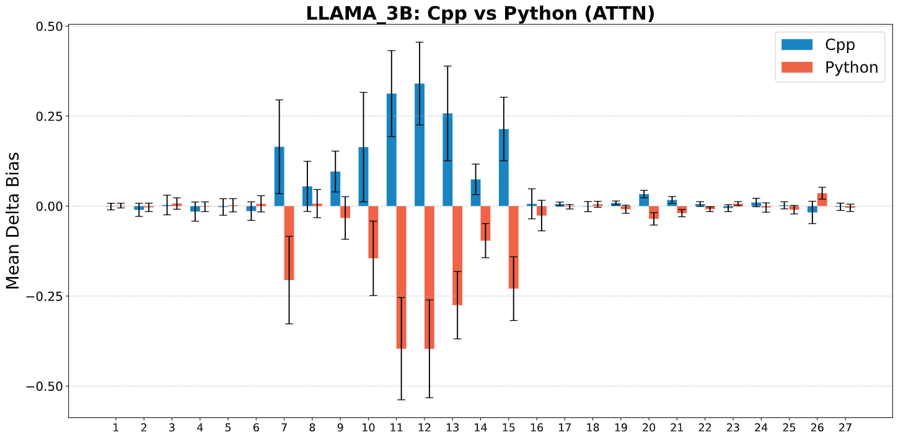
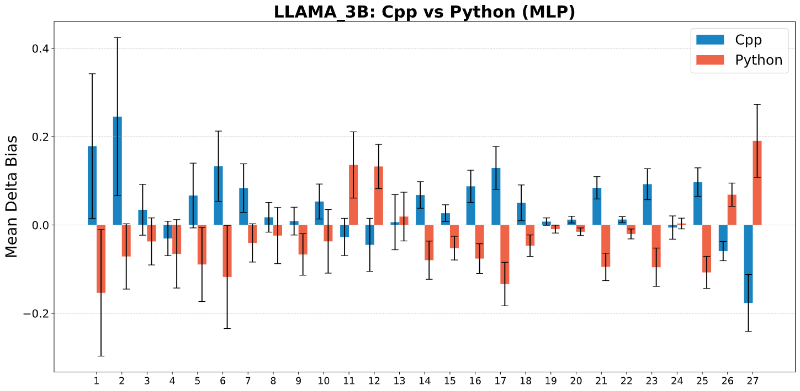
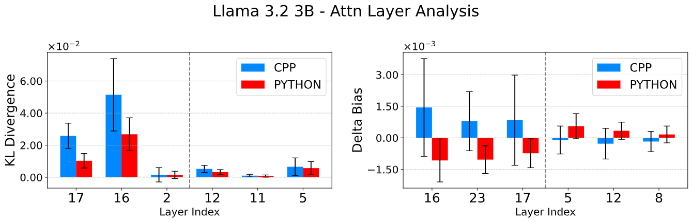
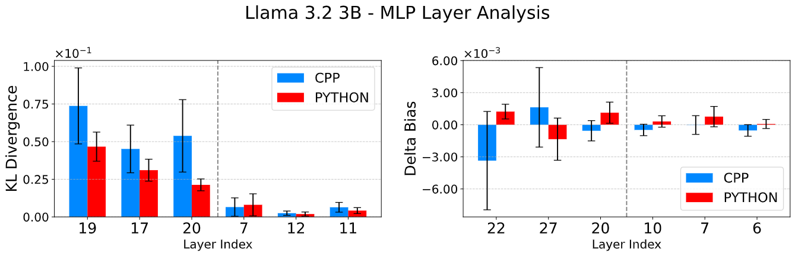

# Causal Intervention

Causal intervention is based on the concept of activation swapping. Activation swapping is the process of running two inferences on an LLM, exchanging outputs of a layer and then observing the effects. The effect that we want to observe is the shift in distribution of output from one domain's tokens to anothers when we run an LLM on a **Domain Classification** task.
The core of the experiment asks, if we transplant the hidden state from a donor prompt in domain $D_b$ into a recipient prompt in $D_a$, does the model's next-token distribution shifts toward $D_b$? We use metrics such as _KL Divergence_ and _Delta Bias_ to quantify our notion of distribution shift.

## Task Description

In previous experiments we have focused on tasks where the LLM has to generate code, or answer some questions on a domain. A problem which arises when we try to do activation swapping using these tasks is that next token prediction depends highly on syntax, semantics, frequency biases and any tokenization quirks. If we patch using prompts which differ along these useless features, we will lose any statistically significant information about domains against noise. We want activation swapping to focus exactly on a single variable on which we can confidently say the activation varies.

To rigorously isolate domain shift from token generation tasks, we create a controlled Domain Classigication task. We construct matched prompt pairs that contain the same information but differ in **exactly** 1 word, the class we wish to classify.

```
Below are two sets of keywords that you need to classify into two domains.
(A): [List of n representative tokens from domain A]
(B): [List of n representative tokens from domain B]
which set is domain X? Answer: Option (
```

From this template, we define the recipient input $x_a$ as the "factual" prompt where the queried domain X corresponds to list (A). Conversely, the donor input $x_b$ is the "counterfactual" prompt where the queried domain X corresponds to list (B). Ideally, the model should predict "A" for $x_a$. Our goal is to determine if injecting activations from $x_b$ steers the model to predict "B".

> Why did we choose this exact structure?

Over the course of our experimental journey, we observed that final bias in the model's prediction depended on multiple factors, such as the position of domain information, few shot examples, structural differences in the prompt pair and whether we asked it to output the name of the class or an option.

Say we ask the model to differentiate between tokens from Science background (such as "gravity", "force", "molecule") and Finance (such as "equity", "balance", "money"). If we ask the model to directly tell the class of first list, it may answer "Physics", "Chemistry", "Astronomy" instead of saying the exact domain which is "Science". To remove this ambiguity, we directly ask it to tell which list corresponds to Science.
If the model is asked to answer in either _A_ or _B_, we removed noise related to semantics and focused concretely on the model's ability to relate sets of tokens to a particular domain or not.

> How are representational tokens created?

There are multiple ways which we explored to generate the representative token list for a specific domain. We create a pool of tokens which represents a whole domain and for each prompt pair, sample $n$ tokens from this pool randomly.Here are some of the methods that we tried:

- **Frequency Analysis**: We take a corpus of documents and texts corresponding to a specific domain. For example, for Science we use corpuses of High-School and College level problem-solution pairs and for Law we use corpuses of US law records. In a corpus, we simply count the frequency of how many times a word occurs and rank them. We remove stop-words such as "the", "he", "she" and take the top 300-400 tokens.
- **Domain Injection**: This novel technique distills the relational information from a different or larger model. We take a neutral prompt and inject a prompt containing information about a domain. We inject this information at different layers and see which tokens rise up in the probability the most. This is done over multiple layers and different models and the results are averaged out. Obvious tokens such as "Science" "scientific study" are removed by hand.

```
Neutral Prompt: List some representative tokens on anything.
Domain Prompt: List some representative tokens on Science.
```

- **Reverse Causal Intervention**: The selection of tokens is done using the same causal intervention process done in reverse on a token generation task. Instead of searching for layers that do the most change in specific tokens, we find tokens that are the most sensitive to intervention on all layers of the model. When we do an intervention on a single layer from one domain to another, the tokens of the new domain are shifted up in probability. The overall shift in vocabulary is averaged across all layers and the top-k "promoted" tokens are saved. For example, when intervening C++ prompts with Python activations, tokens such as def, import and python are promoted.
- **Direct Prompting**: Simply ask the model itself for generating a list of tokens it considers to represent a domain. take this list, clean it up and create a pool of 300-400 tokens.

## Methodology

We focus our analysis on multiple domain pairs (e.g. C++/Python, Medicine/Finance) to ensure generalizability. For a chosen layer $l$ and the final prompt position $t*$, we:

1. run a forward pass on the donor (conflicting) input $x_b$ and save the donor activations $a_l^{donor}(t*)$.
2. run a forward pass on the recipient (correct) input $x_a$ but, at layer $l$ and position $t*$, replace the recipient activation with $a_l^{donor}(t*)$ and continue inference to obtain the patched distribution $p\_{swap(l)}(. | x_a).
3. repeat across many donor-recipient pairs and compute metrics.

## Metrics

#### KL Divergence

For a donor input input $x_b$ and recipient input $x_a$ we define

$$
\begin{equation*}
\mathrm{KL}_{swap_{l}} = \mathbb{E}_{x_a}\left[KL(p(. | x_a) ||p_{swap_l}(.|x_a))\right]
\end{equation*}
$$

where $p(. | x_a)$ is the original next-token distribution and $p_{swap_l}(. | x_a)$ is the patched distribution. The KL divergence measures how strongly the swap perturbs the model's predictive distribution at the intervention point.

#### Delta Bias

To define Delta Bias in a precise way in which we have done in our final results, we need some mathematical formalism.
Let $$V$$be the entire vocabulary of the model. We denote the probability associated with a subset of vocabulary$$S \subset V$$ as

$$
P(S \mid x) = \sum_{i \in S} p(i \mid x)
$$

with a prompt $$x$$. Suppose we perform the intervention $$x_A \xleftarrow{\;\ell\;} x_B$$where activations of prompt of domain$$B$$are inserted into the forward pass of$$A$$at layer$$\ell$$. Before intervention, $$P_{\mathrm{base}}(S_A \mid x_A)$$and$$P_{\mathrm{base}}(S_B \mid x_A)$$denote the probabilities of characteristic tokens of$$A$$and$$B$$before intervention, and$$P_{\mathrm{swap}}(S_A \mid x_A \xleftarrow{\;\ell\;} x_B)$$and$$P_{\mathrm{swap}}(S_B \mid x_A \xleftarrow{\;\ell\;} x_B)$$denote the probabilities of the set of characteristic tokens of$$A$$and$$B$$ after intervention. The Bias present in the probability distribution is defined as

$$
\mathrm{Bias} = P(S_B) - P(S_A).
$$

This represents the model's preference in predicting the intervening subset of tokens.

$$
\mathrm{Bias}_{\mathrm{base}}(x_A) = P_{\mathrm{base}}(S_B \mid x_A) - P_{\mathrm{base}}(S_A \mid x_A)
$$

$$
\begin{equation*}
\mathrm{Bias}_{\mathrm{swap}}\!\left(x_A \xleftarrow{\;\ell\;} x_B\right) = P_{\mathrm{swap}}\!\left(S_B \mid x_A \xleftarrow{\;\ell\;} x_B\right) - P_{\mathrm{swap}}\!\left(S_A \mid x_A \xleftarrow{\;\ell\;} x_B\right)
\end{equation*}
$$

$$
\Delta \mathrm{Bias}(A \xleftarrow{\;\ell\;} B) = \mathbb{E}_{x_A \sim A,\; x_B \sim B} \left[ \mathrm{Bias}_{\mathrm{swap}}\!\left(x_A \xleftarrow{\;\ell\;} x_B\right) - \mathrm{Bias}_{\mathrm{base}}(x_A) \right]
$$
In our results, we use the convention that when $A \xleftarrow{\;\ell\;} B$ is performed, we plot bias with a positive sign, and when we perform the intervention $B \xleftarrow{\;\ell\;} A$, we plot bias with a negative sign to preserve perspective with respect to the set of characteristic tokens $B$. Thus, all bias computations are visualized as the shift in preference of $B$ over $A$.

## Results
We show the results for our experiments on Llama 3b model. Similar results have been observed in other architecutures which we have discussed in the main paper.
#### Delta Bias 





Causal intervention results across all layers for Llama-3.2-3B: Delta Bias when swapping activations between C++ and Python prompts using our domain-classification task. Swapping attention activations produces large, positive  shifts at specific mid-depth layers (e.g., 13-15 , 23-25), indicating sparse routing hotspots. Error bands show standard deviation over 200 prompt pairs.

#### KL Divergence 

When we sort the layers based on their fisher seperability, we observe that layers with higher fisher seperability have higher KL divergence on activation swapping. This fact is true for both mlp and attention components. 





Analysis of layers in Llama-3B, comparing KL divergence (left) and a Delta Bias (right) between C++ and Python inputs. The layers on left section ar e layers with highest Fisher score and right section have lowest Fisher score. Top-ranked layers show substantially higher KL divergence and Delta Bias, reflecting higher influence on final output.
