# Visualizing the Locus of Learning: An Analysis of Fine-Tuning Llama 3.2

## Objective

The primary goal is to **identify and quantify how a model's parameters adapt when trained on a new, specialized task**. By analyzing the changes in the trainable weights before and after fine-tuning, we aim to visualize which parts of the neural network are most significantly modified. This analysis helps reveal the "locus of learning," indicating whether the model primarily adjusts its foundational, early-layer representations or its abstract, late-layer reasoning capabilities to master a new domain.

## Methodology

The experiment was conducted using the `meta-llama/Llama-3.2-3B` model. To make the fine-tuning process computationally feasible, we employed **QLoRA (Quantized Low-Rank Adaptation)**, a highly efficient Parameter-Efficient Fine-Tuning (PEFT) technique.

The core of the methodology is a precise, step-by-step process:

1.  **Model Quantization**: The base `Llama-3.2-3B` model was loaded using a 4-bit NormalFloat (`nf4`) quantization configuration via `BitsAndBytesConfig`. This dramatically reduces the VRAM footprint by loading the model's weights in 4-bit precision, making it possible to run on a single GPU. The computation, however, is performed in `bfloat16` for stability and performance.

2.  **Low-Rank Adaptation (LoRA)**: Instead of training all 3 billion parameters of the model, we freeze the base model and inject small, trainable "adapter" matrices into the attention layers. Using the `peft` library, a `LoraConfig` was applied with the following key parameters:
    *   `r=16`: The rank of the update matrices, determining the number of trainable parameters.
    *   `lora_alpha=32`: A scaling factor for the LoRA updates.
    *   `target_modules=["q_proj", "k_proj", "v_proj", "o_proj"]`: The trainable adapters were specifically applied to the query, key, value, and output projection matrices within each self-attention block of the transformer architecture.

## Why Lora is a Valid Proxy for full training 

Instead of modifying a huge, pre-trained weight matrix `W` (which has millions of parameters), LoRA keeps `W` frozen. It learns the *change* to the weights, `ΔW`, by representing this change as the product of two much smaller, "low-rank" matrices, `A` and `B`. During a forward pass, the model's output is calculated as `h = Wx + BAx`. Only `A` and `B` are trained. Because `A` and `B` are tiny compared to `W`, we are training only a fraction of a percent of the total parameters, leading to massive savings in memory and computation time.

**Why This Shows Similar Results to Full Training:** This experiment's methodology is grounded in a key research finding known as the **"low-rank hypothesis."** Studies have shown that when large pre-trained models are fully fine-tuned, the matrix representing the change in weights (`ΔW = W_final - W_initial`) tends to have a very low "intrinsic rank." This means the complex update across millions of parameters can be effectively approximated without losing significant information. LoRA is explicitly designed to create such a low-rank update. Therefore, by constraining the update to be low-rank, LoRA is not just an efficiency hack; it's a **principled approximation of the full fine-tuning process.** Analyzing where LoRA applies its largest changes gives us a strong and valid insight into which layers would have been most modified during a full fine-tuning run.

### The Experimental Process

1.  **State Capture**: Before training began, a snapshot of the initial, randomly-initialized LoRA adapter weights (`A` and `B` for all targeted modules) was saved.
2.  **Training**: The model was fine-tuned for a single epoch on a `40%` fraction of a specialized dataset (e.g., `math_solution.json`). A batch size of 2 and 4 gradient accumulation steps were used, with a learning rate of `1e-3`.
3.  **Final State Capture**: After training, the final state of the LoRA adapter weights was captured.

## Analysis & Metrics

The core of the analysis is comparing the final LoRA weights to their initial state. For every trainable parameter, we calculate the **delta (Δ)**, which is the difference between the final and initial weight values:

**Δ = Weightafter training - Weightbefore training**

For each trainable LoRA adapter matrix (e.g., the `q_proj` matrix in layer 15), the following metrics were computed from its delta tensor (Δ):

*   **Mean Change**: `mean(Δ)`. The average of all weight changes. It indicates the overall directional bias of the updates (i.e., did weights tend to increase or decrease?). A value near zero suggests a balanced shift.
*   **Variance of Change**: `var(Δ)`. The variance of weight changes. This shows the spread or diversity of modifications within a single matrix.
*   **Mean Absolute Change**: `mean(abs(Δ))`. The average of the absolute values of all weight changes. **This is the key indicator of the total magnitude of adaptation.** A higher value signifies that the layer underwent more significant changes, regardless of their direction.
*   **Variance of Absolute Change**: `var(abs(Δ))`. The variance of the absolute changes, indicating how uniformly the magnitude of change was distributed across the weights in the matrix.

To create a clear, high-level overview, these individual matrix-level statistics were **aggregated by their parent transformer layer number**. This averages the metrics from the `q_proj`, `k_proj`, `v_proj`, and `o_proj` adapters for each layer, providing a macroscopic view of how learning was distributed across the model's depth.

## Results

The following plots visualize the aggregated weight changes across the model's transformer layers for different fine-tuning domains. The **Mean Change** plot (left) shows directional bias, while the **Mean Absolute Change** plot (right) reveals the magnitude of learning and is the primary focus for interpretation.

### Comparative Weight Changes Across Domains

| Mean Change Across All Domains                               | Mean Absolute Change Across All Domains                              |
| :-----------------------------------------------------------: | :-------------------------------------------------------------------: |
| 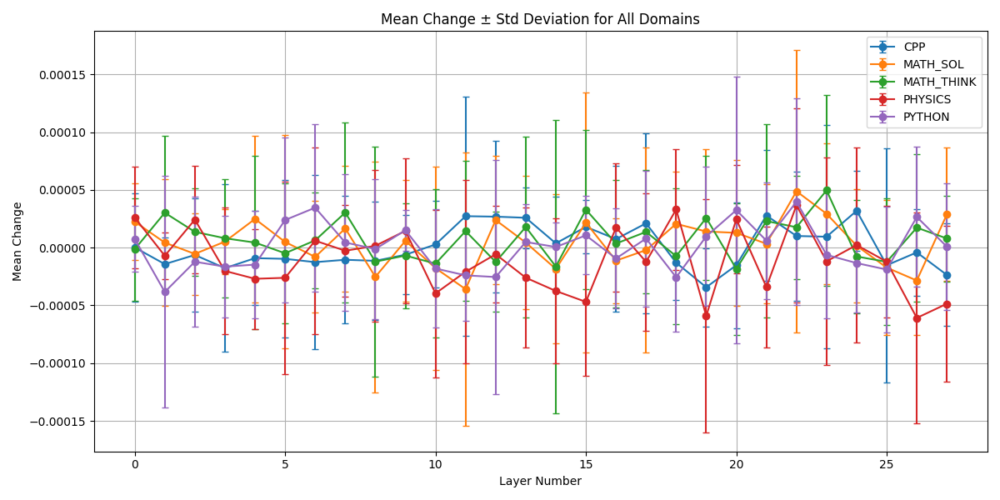                                      | 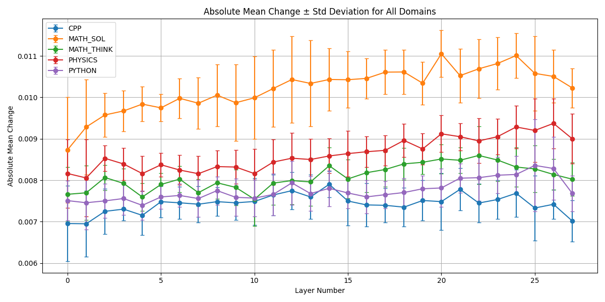                                          |

### Weight Change Across Layers in Individual Domains

**C++ Domain**
| Aggregated Mean Change (C++)                                  | Aggregated Mean Absolute Change (C++)                                 |
| :-----------------------------------------------------------: | :-------------------------------------------------------------------: |
| 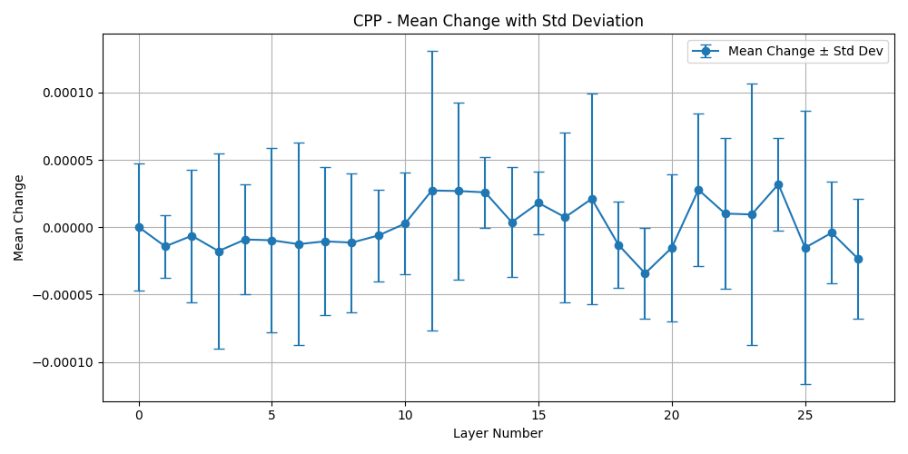                                             | 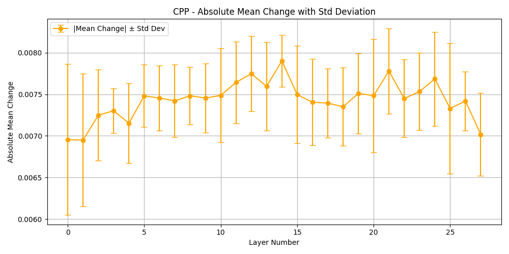                                                 |

**Python Domain**
| Aggregated Mean Change (Python)                               | Aggregated Mean Absolute Change (Python)                              |
| :-----------------------------------------------------------: | :-------------------------------------------------------------------: |
| 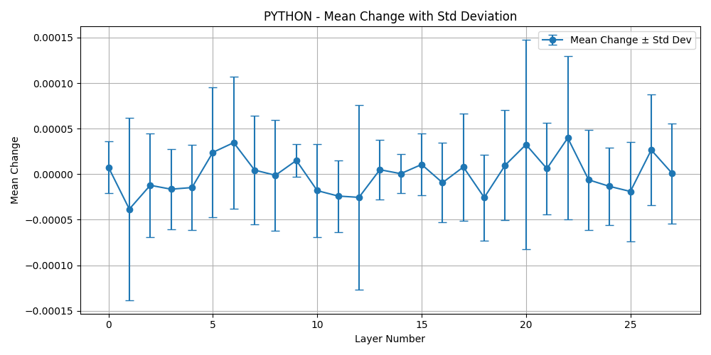                                          | 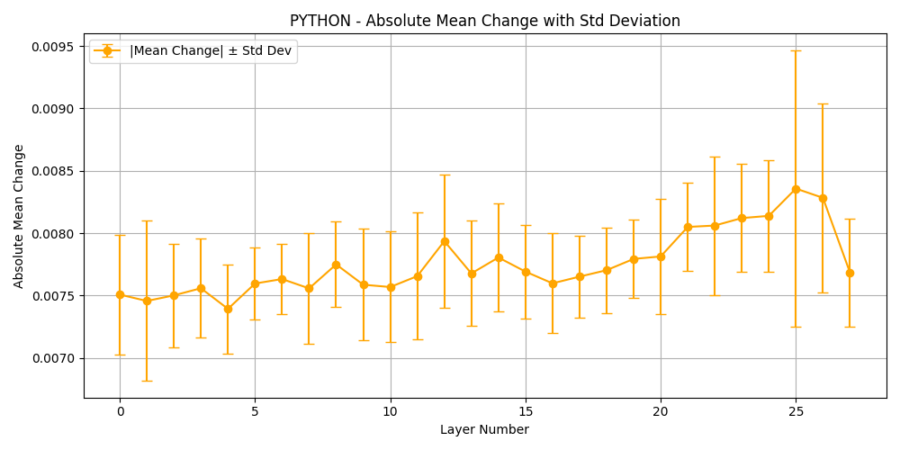                                              |

**Physics Domain**
| Aggregated Mean Change (Physics)                              | Aggregated Mean Absolute Change (Physics)                             |
| :-----------------------------------------------------------: | :-------------------------------------------------------------------: |
| 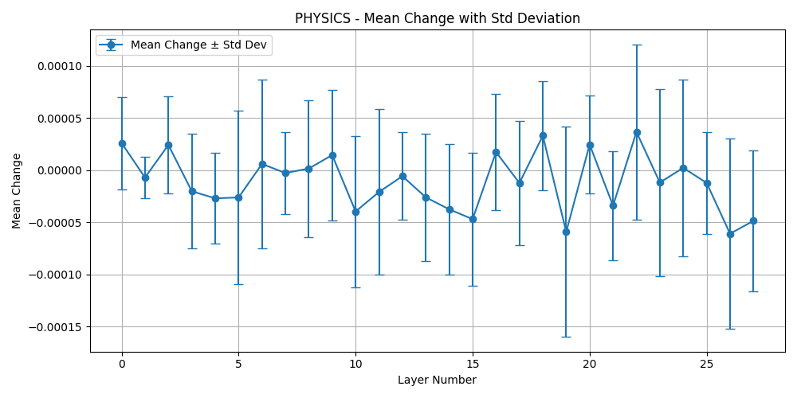                                         | 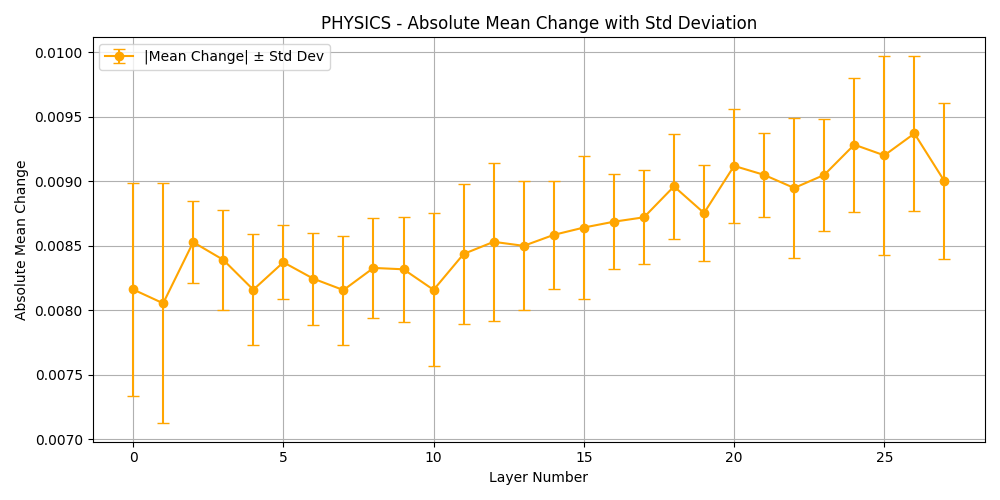                                             |

**Mathematical Solutions Domain**
| Aggregated Mean Change (Math Sol)                             | Aggregated Mean Absolute Change (Math Sol)                            |
| :-----------------------------------------------------------: | :-------------------------------------------------------------------: |
| 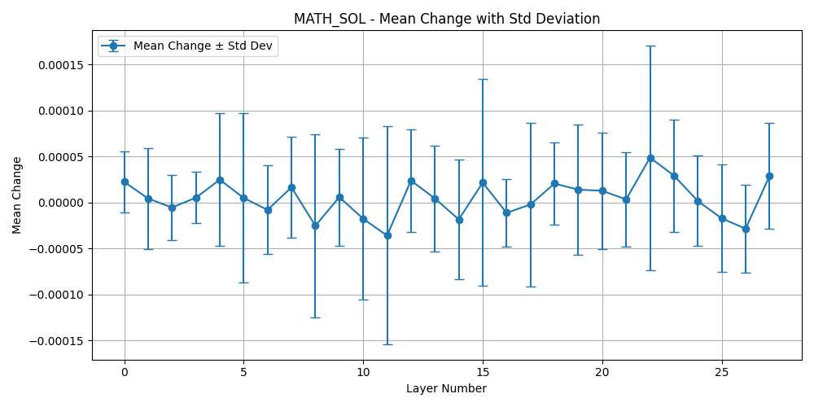                                        | 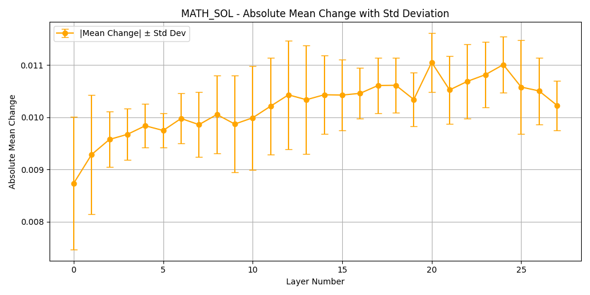                                            |

**Mathematical Thought Process Domain**
| Aggregated Mean Change (Math Think)                           | Aggregated Mean Absolute Change (Math Think)                          |
| :-----------------------------------------------------------: | :-------------------------------------------------------------------: |
| 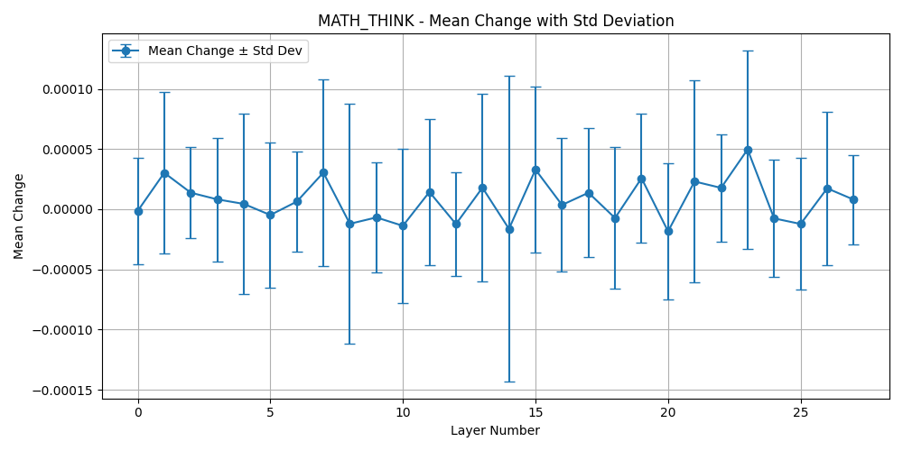                                      | 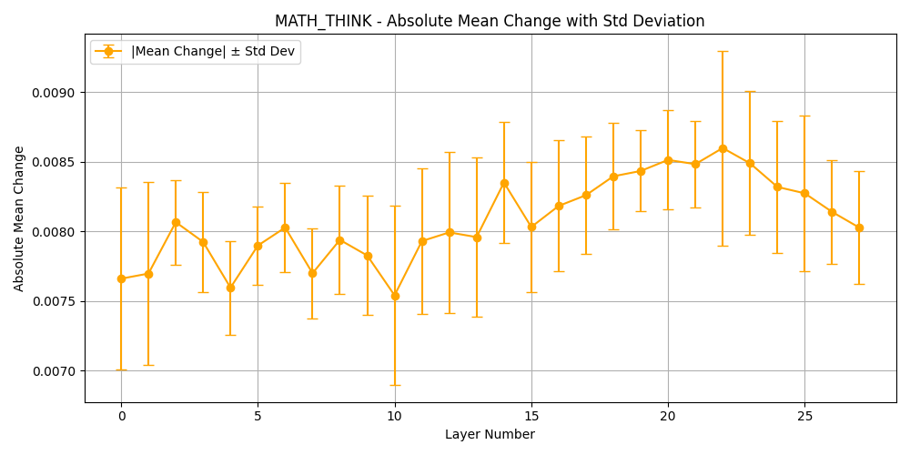                                          |
