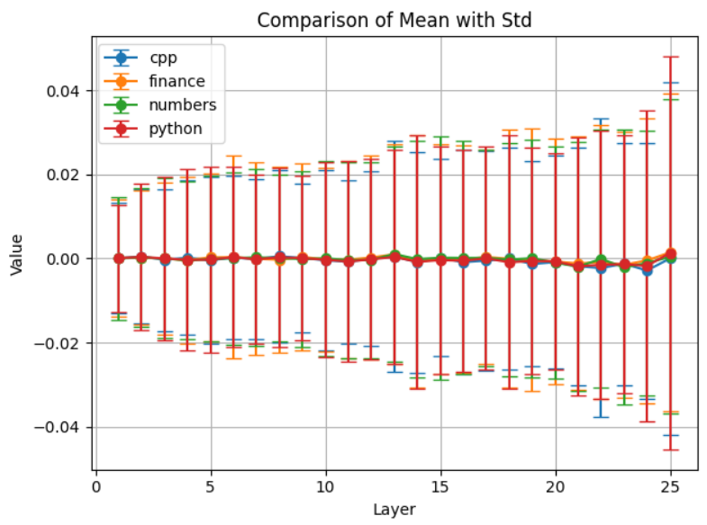
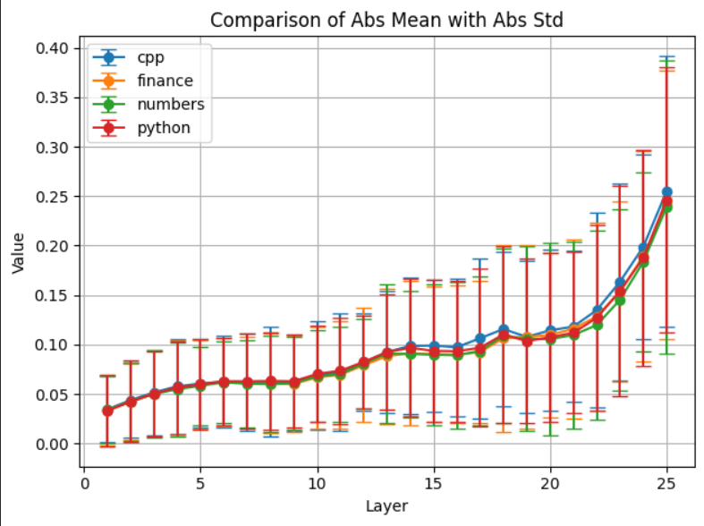
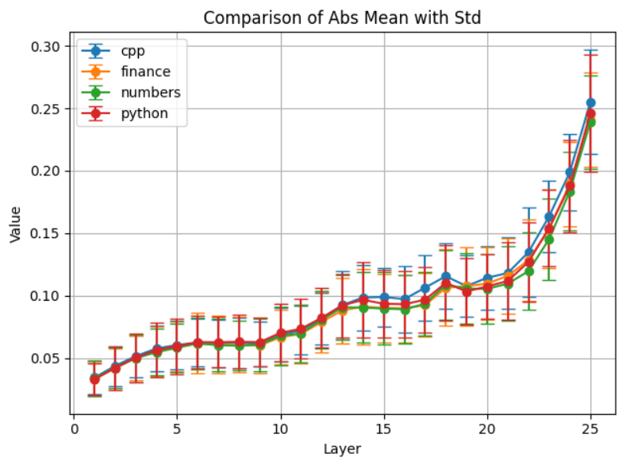
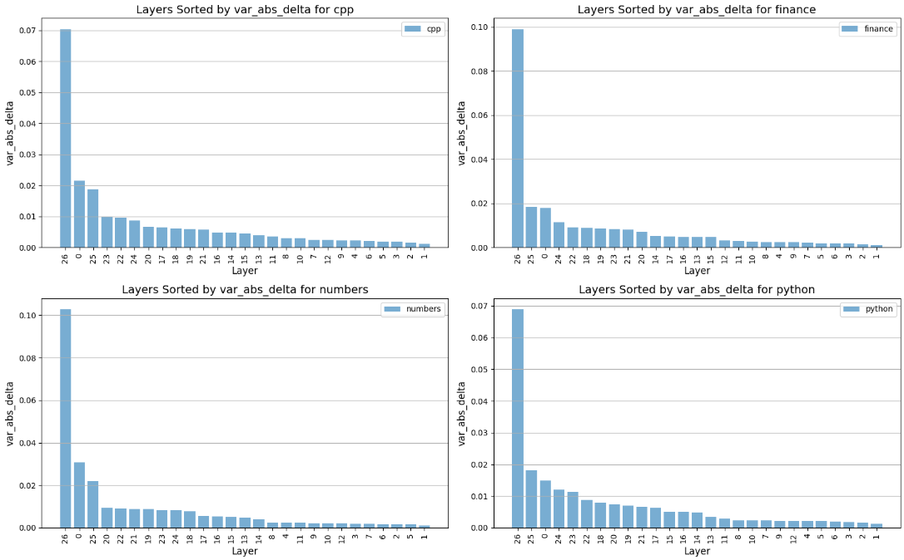

## Overview
In this experiment, we use the Llama 3.2 3b parameter model as our target model. Our goal is to see which layers of the model contribute the most towards the final logits. For this, we set-up functional hooks that extract the output matrix of each layer after a single forward pass. We convert this matrix into the absolute mean of its elements. Then, we take the mean and variance of this statistic over the whole dataset and plot the result. This is done for 6-7 datasets and the results are plotted. 
## Implementation
Firstly, we process the datasets and convert them into a single Json object containing list of strings of text from a large corpus from various domains. These domains include C++ code, Python code, mathematical reasoning, financial news, legal ledgers, medical reports and summaries of US bills. We expect that these domains are different enough to show a clear distinction between the layer outputs. 
We load a pre-trained Llama 3.2 3b parameter Causal Language Model from HuggingFace. Then we use Pytorch's built in methods to set up forward hooks. Forward hooks are functions that execute during the forward pass and provide access to input/output tensors. Using these we can store the contributions of a layer towards the residual stream. 
```python
# ---- Hook Setup ----
hook_storage = {}

def set_hook(name):
    def hook(model, input, output):
        if isinstance(output, tuple):
            output = output[0]
        hook_storage[name] = output.detach().cpu()  # move to CPU to save VRAM
    return hook

# ---- Register Hooks Once ----
for i, layer in enumerate(model.model.layers):
    layer.register_forward_hook(set_hook(f"layer-{i}"))
```
We pass the input texts through the model and, at each layer, compute the change in the residual stream — specifically, the difference between consecutive layer outputs. For each input and each layer, we record the mean and the absolute mean of the elements of this change matrix. After processing all inputs, we calculate the average and variance of these statistics across the dataset for each layer. The final results, which reflect how much each layer changes the residual stream on average, are saved in a CSV file for further analysis. 
## Results
We compute the following statistics from the data:
- Absolute mean of change matrix over each dataset: 
- mean of change matrix over each dataset
- standard deviation of absolute mean of change matrix over each dataset
- standard deviation of mean of change matrix over each dataset 

### Visualizing the statistics: 



We also compare the variance in layers for different datasets. 
