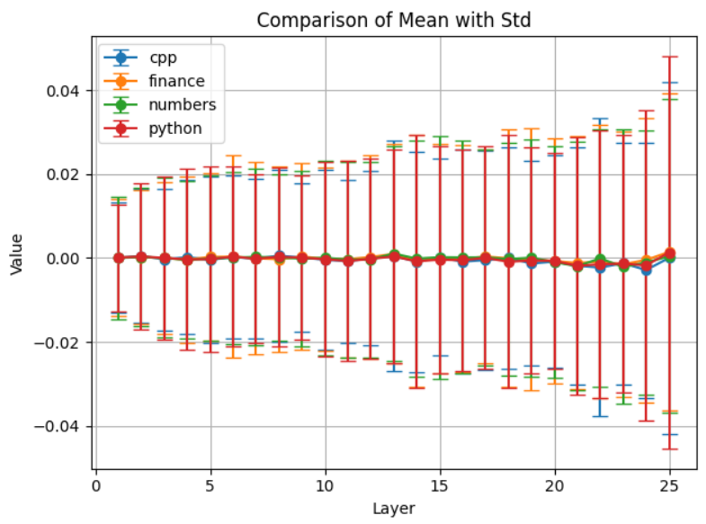
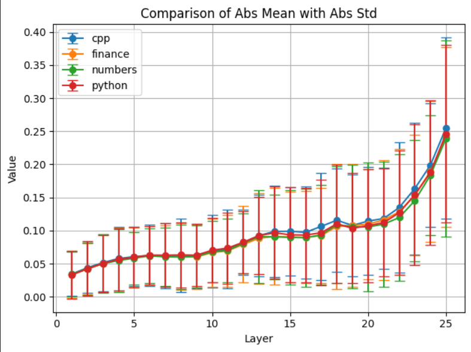
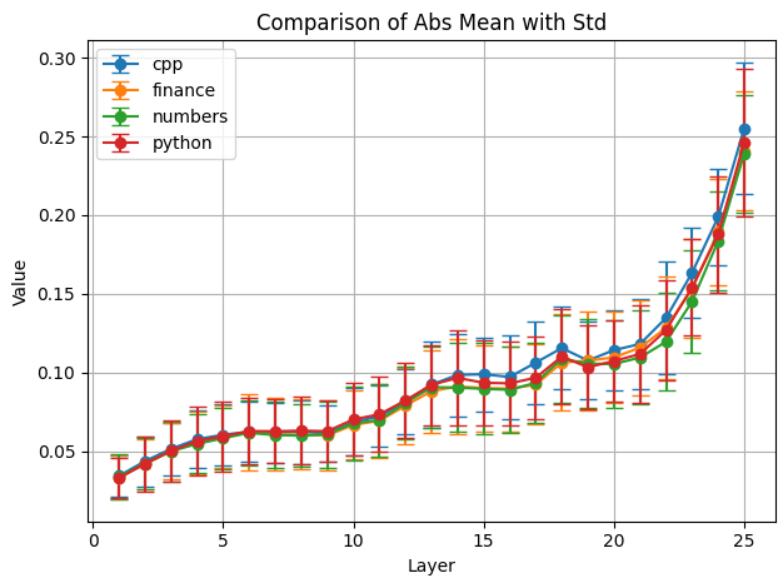

# Layerwise Profiling of LLaMA-3: Measuring How Much Each Transformer Layer Contributes

Large Language Models such as Llama-3 or ChatGPT are black boxes with hundreds of layers where the exact interactions between the layers cannot be understood completely. However, we believe that not all layers are equally responsible for the model's output. By conducting a variety of experiments, we can understand which layers are more active in the contributions to an output. This page explores the technique of Forward Pass Profiling which measures how much each layer changes the internal representation of the input. 
## Dataset
We select our datasets so that they cover a large field of technical domains. The motivation behind this is to check if different domains create sufficient model behaviour shift to be seen in layer contributions over a large set of inputs. 
| Dataset | Domain Type | Example Snippet                    |
|---------|-------------|------------------------------------|
| C++ Corpus | Programming | `#include <iostream> int gcd(int a, int b)...`|
| Python Corpus | Programming | `def f(x): if x == n: return "0"...` |
| Finance News | Finance | `Shares of Franco-Nevada Corp. dropped by 0.86% ...`|
| Numbers | Mathematics | `To solve the equation \(\sqrt{x^2 - 165}) = 5...` |
## Profiling Methodology
We pass the input texts through the model and, at each layer, compute the change in the residual stream. For each input and each layer, we record the mean and the absolute mean of the elements of this change matrix as a concise representation of the contribution of the layer. After processing all inputs, we calculate the average and variance of this contribution across each layer. The final results, which reflect how much each layer changes the residual stream on average, are saved in a CSV file for further analysis. The variations and mean changes of these contributions represent a profile for the model's behaviour for a model. 
## Implementation
Firstly, we process the datasets and convert them into a single Json object containing list of strings of text from a large corpus from various domains. These domains include C++ code, Python code, mathematical reasoning, financial news, legal ledgers, medical reports and summaries of US bills. Results are computed for the 4 main datasets only. 
We load a pre-trained Llama 3.2 3b parameter Causal Language Model from HuggingFace. Then we use Pytorch's built in methods to set up forward hooks. Forward hooks are functions that execute during the forward pass and provide access to input/output tensors.
```python
# ---- Hook Setup ----
hook_storage = {}

def set_hook(name):
    def hook(model, input, output):
        if isinstance(output, tuple):
            output = output[0]
        hook_storage[name] = output.detach().cpu()  # move to CPU to save VRAM
    return hook

# ---- Register Hooks Once ----
for i, layer in enumerate(model.model.layers):
    layer.register_forward_hook(set_hook(f"layer-{i}"))
```
**Explanation**: This code registers forward hooks on each transformer layer of the model to capture their output during a forward pass. The outputs are detached and moved to CPU to reduce memory usage, then stored in a global dictionary (`hook_storage`) keyed by layer name. This allows us to analyze how much each layer contributes to the residual stream without altering the model’s architecture.
```python
# ---- Process Texts ----
num_layers = len(model.model.layers)
def process_texts(texts):
    all_mean_deltas = [[] for _ in range(num_layers - 1)]
    all_abs_mean_deltas = [[] for _ in range(num_layers - 1)]
    for text in tqdm(texts):
        inputs = tokenizer(text, return_tensors="pt").to(device)
        hook_storage.clear()


        with torch.no_grad():
            _ = model(**inputs)
    
        layer_outputs = [hook_storage[f"layer-{i}"] for i in range(num_layers)]
        # ----- Per Layer Contributions ----- 
        for i in range(num_layers - 1):
            delta = layer_outputs[i + 1] - layer_outputs[i]
            all_mean_deltas[i].append(delta.mean().item())
            all_abs_mean_deltas[i].append(delta.abs().mean().item())
    return all_mean_deltas, all_abs_mean_deltas
```
**Explanation**: For each input text, this function tokenizes the string and runs it through the model while collecting the output of every transformer layer via hooks. Since each layer adds its contribution to the residual stream, we compute the layer’s *actual contribution* as the difference `delta` between consecutive residual outputs. This `delta` is a matrix of hidden states across all tokens, and we summarize it using both the mean and absolute mean. The function returns these values for every layer, across all input texts.


## Statisitical Metrics Computed
- **Mean of Change Matrix**: Tells if the change was overall positive or negative
- **Absolute Mean of Change Matrix**: Tells the magnitude of change 
- **Variance of Absolute Mean**: Consistency of the layer across multiple inputs
>A great analogy for understanding these statistics is the Painter's Analogy. Some painters (layers) make bold strokes (Large Abs Mean) while some adjust slightly (Small Mean). The Variance tells us if the Layer acts consistently or if it reacts heavily to a inputs. 

## Observations


**Inference**: The mean of all layers is at zero. This is expected since the changes in the change matrix do not proritize a single direction, they can encode contributions in both positive and negative directions. We can see that the deviation is larger which suggests layers contribute equally to both positive and negative changes. 



**Inference**: We can see that the latter layers perform most of the heavy lifting of creating changes in the final output. This aligns with the Transformer theory that latter layers do more semantic computations and are aligned much closer to final logits while initial layers handle low level processing. 
The deviation of the Abs Mean is consistent across all datasets for the first few layers. In the intermediate and final layers, we observe slight variations for each dataset. However, the differences are too small for us to come to definitive conclusions. 

 

**Inference**: Instead of plotting the Abs mean with its own deviation, we visualize the impact of the Mean Std. This reveals how the CPP dataset behaves slightly differently from the other datasets. It shows higher mean from layer 15 to 22. The other datasets follow almost the same trend. 


**Inference**: We explicitly plot the varaince data of all layers. These show how the last layer and first layer are much more input sensitive than the intermediate layers. As we can see in the plot. layer 26, 0, 25 generally show maximum variance. In each dataset, the exact ordering of layers is different. 