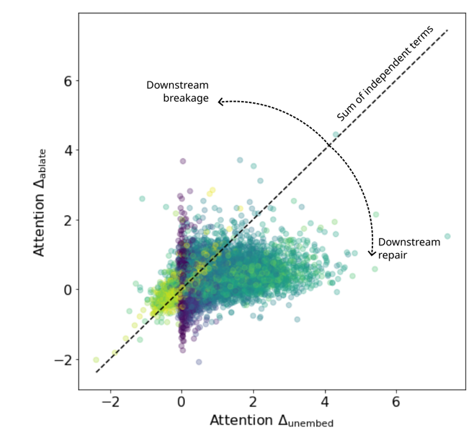
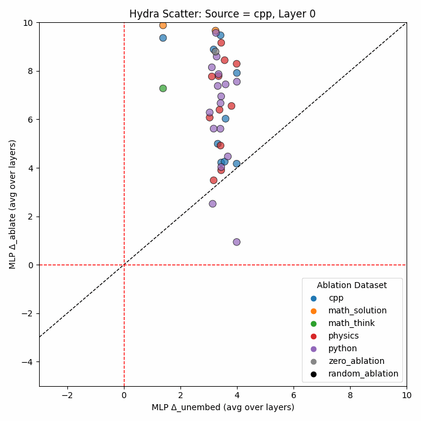
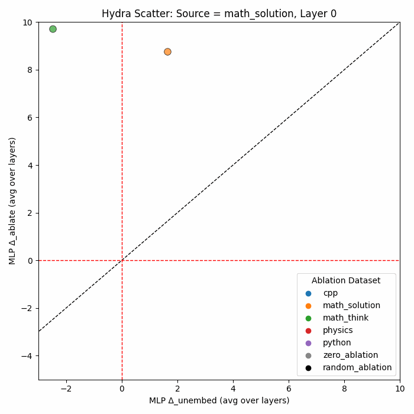
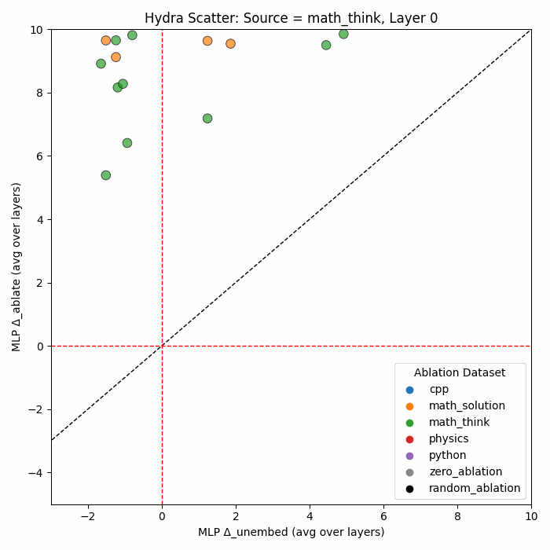
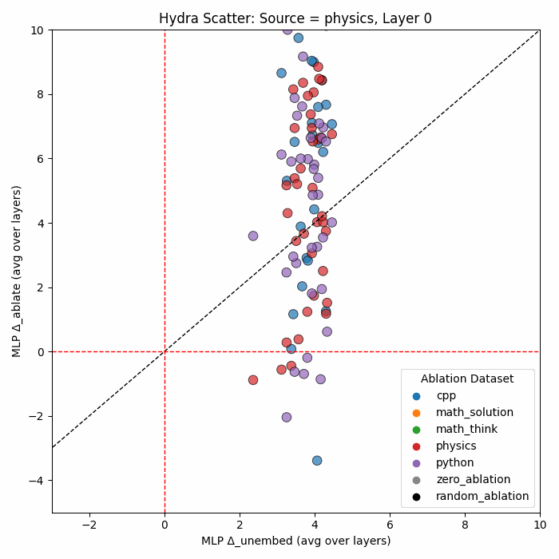
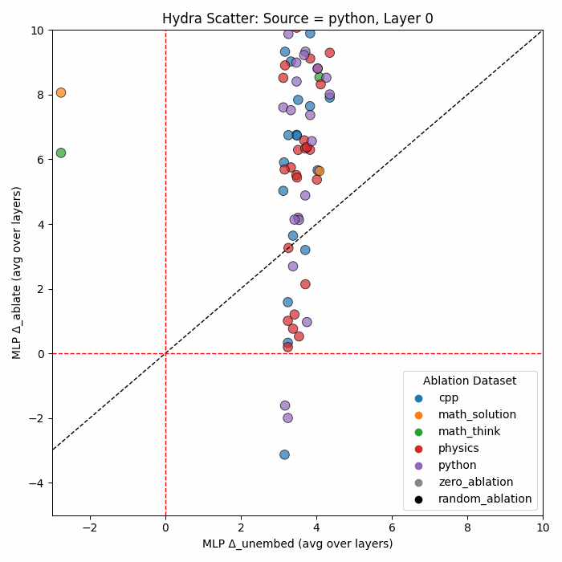

# Hydra Effect
In this experiment, we utilize the concept of Hydra Effect to analyze the domain knowledge stored in layers from a different prespective. 
## Laying out the theoretical basis
The Hydra Effect was coined first in a 2023 paper by Google DeepMind team where they investigate the internal structure of LLM computations using causal analysis. They show how LLMs adapt to ablations of one layer by compensating for the change by counterbalancing the activations of subsequent layers. This effect is called the Hydra effect since it resembles the behaviour of the Hydra monster, in which other heads grow in importance when one set of heads is cut off. They show that LLMs exhibit not only just redundancy but also active self-repairing computations. To create a representation of how a layer adjusts its outputs for self-repair, the researchers use unembedding logits.

### The basics
First we need to define some terminology. Suppose a Transformer model has $$L$$ layers. It aims to predict the next token $$x_{t+1}$$ given the sequence of input tokens $$x_{\leq t} = (x_1, x_1, ...., x_t)$$ using a function $$f_{\theta}$$ which is our transformer. 
$$
\begin{equation*}
    \begin{split}
    p(x_{t+1} | x_{\leq t}) & = f_{\theta}(x_{\leq t}) = \text{SoftMax}(\pi_t(x_{\leq t}))\\
    \end{split}
\end{equation*}
$$
Here the pre-softmax terms $$\pi$$ are called logits. Our whole analysis shall be based on these values for the last position in the sequence. 
$$
\begin{equation*}
    \begin{split}
        \pi_t &= \text{RMSNorm}(z_t^L)W_U \\
        z_t^l &= z_t^{l-1} + a_t^l + m_t^l \\
        a_t^l &= \text{Attn}(z_{\leq t}^{l-1}) \\
        m_t^l &= \text{MLP}(z_t^{l-1}) \\
    \end{split}
\end{equation*}
$$
For a standard Transformer, the process of unembedding, i.e., obtaining the logits is performed only on the output of the last layer to get the final prediction. But what if we did this process on earlier layers as well?

### A layer's individual contribution
This process of applying the unembedding mechanism on an earlier layer is called logit lens. This shows the model's current understanding of the inputs till that layer. Suppose $$\tilde \pi_t^l$$ is the logit distribution for a particular layer $$l$$. We can apply the learned Unembedding Matrix $W_U$ and RMSNorm layer from the last layer on the output of this layer to compute this distribution.
$$
\begin{equation*}
    \begin{split}
        \tilde \pi_t^l &= \text{RMSNorm}(z_t^l)W_U \\
    \end{split}
\end{equation*}
$$
It should be noted that for any kind of analysis on logits, it is necessary to centre them since their absolute values are not important. We only want to see the relative shifts that the layer assigns to different tokens. 
$$
\begin{equation*}
    \begin{split}
        \^{\pi}_t = \tilde \pi_t - \mu_{\pi};\quad \mu_{\pi} = \frac{1}{V} \sum_i^V [\tilde \pi_t]_i \\
    \end{split}
\end{equation*}
$$
The metric to check the layer's impact on the final output is the value of this centred logit for the maximum-likelihood token at the final token position for the last layer. 
$$
\begin{equation*}
    \begin{split}
        \Delta_{\text{unembed}, l} = \^{\pi}_t(a^l)_i ; \quad i = \argmax_j[\pi_t^L]_j
    \end{split}
\end{equation*}
$$
### The process of ablations 
Next, we look at the process of ablations, which means surgically removing the acitvations of one layer for a particular input and replacing it with a different value. For example, zero-out ablation means removing the layer's output and setting all values to zero and putting it back. 
For mathematically denoting the ablation we need some additional notation that is standard in the field of causality. The researchers indicate replacing activations of a layer $$a_t^l$$ with another using the do(.) operation. Then the intervention on the output of a layer $$A_t^l$$ with output from another input $$x'$$ can be denoted as, 
$$
\begin{equation*}
    \begin{split}
        \pi_t(x_{\leq t}| \text{do}(A^l_t = \tilde{a}_t^l)) = \pi_t(x_{\leq t}| \text{do}(A^l_t = a_t^l(x'_{\leq t})))
    \end{split}
\end{equation*}
$$
By ablating a layer, we can see how the subsequent $$\Delta_\text{unembed}$$ changes for other layers. Suppose $$\^\pi$$ is the centered logit of the maximum-likelihood token i for a given input $$x_{\leq t}$$. The overall effect of ablation of the layer l is denoted by $$\Delta_\text{ablate}$$ which can be calculated as:
$$
\begin{equation*}
    \begin{split}
        \Delta_\text{ablate,l} = \left[\^\pi(x_{\leq t}|do(A_t^l = \tilde a^l_t)) - \^\pi_t(x_{\leq t})\right]_i
    \end{split}
\end{equation*}
$$

### Where's the hydra effect?
Intuitively, we would expect that $$\Delta_\text{ablate}$$ and $$\Delta_{\text{unembed}}$$ should agree with each other to some degree. Because, by ablating a layer, it should remove that layer's contribution (measured by $$\Delta_{\text{unembed}}$$) as well as ruin the downstream layer's contributions as well (the overall contributions being measured by $$\Delta_\text{ablate}$$). Ideally, $$\Delta_\text{ablate} \geq \Delta_{\text{unembed}}$$, but we see the opposite trend. This trend implies that downstream layers are recovering the ablated layer's contributions so that the final impact is still similar. 

## Overall summary of the process
Now that the theoretical background of our experiment is done, let's now discuss what our goal is. We wish to see how ablating different dataset's activations over another dataset's activations causes the model to affect the logit of the predicted token. We shall plot the graphs for $$\Delta_\text{ablate}$$ against $$\Delta_{\text{unembed}}$$ for different datasets for a particular layer, or the average of these values for a set of layers that were indiviually ablated. For this, we use 3 different kinds of ablations. 
- Zero ablation, meaning we essentially remove that layer's output entirely. 
- Random ablation, we replace the activation with a random ablation that follows the distribution of normal inputs. 
- Replacement ablation, where we replace the activation of an input from one dataset and substitute the activations for another input in that layer. 

We wish to see which types of ablations demonstrate the hydra effect and on which layers. Also, in the case they do show hydra effect, what what can we infer from it. To visualize what Hydra effect looks like in a graph, we can refer to the ideal case given by the researchers. 



This is a graph from the Hydra effect paper. As stated in theory, if Hydra effect was absent, we expect that $$\Delta_\text{ablate}$$ and $$\Delta_{\text{unembed}}$$ should agree with each other and the scatterplot should align with the diagonal line. But we see a different scenario. Values under the diagonal line showcase the effect of Downstream repair since $$\Delta_\text{ablate}$$ < $$\Delta_{\text{unembed}}$$. 

## Implementation
As is common with other experiments, we load the Llama-3.2-3B model in our kaggle notebook. 
#### Hyperparams and Constants
```python 
input_size = 256
resample_size = 5
replacement_store_size = 25 
sample_size = 50 
```
**Explanation:** The `input_size` is size of the context window we shall be using. This needs to be fixed so that hooks do not ablate activations with mismatched tensor sizes. `resample_size` is the number of ablation activations will be used per input. the $$\Delta_\text{ablate}$$ for that input will be the average of all the $$\Delta_\text{ablate}$$'s that these resamples produce. We pre-compute the ablating activations for all layers for a particular dataset and store it in a replacement_store dictionary of size `replacement_store_size`. The resampling will be done from this store in a random fashion. `sample_size` is simply the number of inputs will be run per dataset. 

#### Hook Setup 
Below is the essence of our hook setup. Some details such as error handling and output manipulation (such as in case of attn layer outputs) have been omitted. 
```python 
# hook_outputs is a dictionary that stores the outputs for the hooks for each input pass. 
# layer_mode is set to "capture" as default for each (layer_idx, block_type) tuple 
def make_hook(block_type, layer_idx):
    def hook(module, input, output):
        mode = layer_mode[(layer_idx, block_type)]
        if mode == 'zero':
            result = torch.zero_like(out_tensor)
        elif mode.startswith("replace::"): # eg mode = replace::python
            dataset_name = mode.split("::")[1]
            result = random.choice(replacement_store[dataset_name][block_type][layer_idx])
        elif mode == 'random':
            std = replacement_std[block_type][layer_idx].unsqueeze(0)
            result = torch.randn_like(out_tensor) * std
        else: # default: capture
            result = out_tensor
        
        hook_outputs[block_type][layer_idx] = result
        return result
    return hook

# Attach hooks once globally
for l in range(len(model.model.layers)):
    model.model.layers[l].mlp.register_forward_hook(make_hook('mlp', l))
    model.model.layers[l].self_attn.register_forward_hook(make_hook('attn', l))
```
**Explanation:** There are 4 modes a hook can have. Since we cant change the state of the hook once it is attached, we make the hooks refer to a global dictionary `layer_mode` that contains the mode for each forward pass. 
- **Zero Mode:** Simply ablate the output with a zero tensor of the same shape as the expected output
- **Replacement Mode:** Replace the activations of the layer with activations from another dataset input. The input is chosen randomly from a list of possible inputs for the selected ablation dataset. For example, suppose we are ablating the MLP of layer 15 with input from dataset "python". The mode will be set to `replace::python`. The location `layer_mode["python"]["mlp"][15]` will be a list of possible activation tensors out of which 1 will be chosen randomly. 
- **Random Mode:** Replace the output with a random tensor that has the same distribution as the inputs over all datasets. This ensures that the random tensor could be a naturally occuring activation. The replacement_std is a dictionary that contains the standard deviations of all activations per layer. 
- **Capture Mode:** Store the output in hook_output and continue. This is default behaviour and only records the activations without interfering with the behaviour of the model during forward pass. 

#### Computing the replacement store
```python 
def compute_replacement_store(paragraphs, dataset_name, num_layers, max_samples, max_length=input_size)
    for key in layer_mode:
        layer_mode[key] = "capture" # Ensure all layers are set to be captured 

    count = 0
    for paragraph in paragraphs:
        if count >= max_samples:
            break
        hook_outputs['mlp'].clear()
        hook_outputs['mlp'].clear()

        inputs = tokenizer(
            paragraph,
            return_tensors='pt',
            truncation=True, 
            max_length=max_length,
            padding="max_length"
        )
        with torch.no_grad():
            _ = model(**inputs) # hooks store the outputs 
        
        # shift the data from hook_outputs to a list in the replacement store 
        for block_type in ['mlp', 'attn']:
            for l in range(num_layers):
                if l in hook_outputs[block_type]:
                    tensor = hook_outputs[block_type][l]
                    replacement_store[dataset_name][block_type][l].append(tensor)

        count += 1
    return replacement_store

# domain_files is a dictionary of file paths 
for domain, path in domain_files.items():
    # load the data in a dictionary as well as update the replacement store for each dataset
    with open(path, 'r') as file:
        data = json.load(file)
        dataset_data[domain] = data

    replacement_store.update(compute_replacement_store(data[sample_size+1:], domain, num_layers=len(model.model.layers), max_samples=replacement_store_size))
```
>**Note:** using `data[sample_size+1:]` instead of directly using `data` in the last line ensures that the replacements leave some samples as normal inputs and use the remaining for computation for ablations. For example, if we are normally passing as inputs the first 25 inputs, the replacement stores has the replacements from the rest of the dataset. This ensures we never mistakenly ablate the input with itself.

#### Delta_unembed implementation
```python
def delta_unembed(paragraph, max_length=INPUT_SIZE):
    # Step 1: Tokenization 
    inputs = tokenizer(
        paragraph,
        return_tensors="pt",
        truncation=True,
        max_length=max_length,
        padding="max_length"
    ).to(device)

    # Step 2: Forward Pass
    with torch.no_grad():
        outputs = model(**inputs, output_hidden_states=True)
        logits = outputs.logits
        target_token = torch.argmax(logits[0, -1])

        # Step 3: Storing the Unembedding Mechanism
        W_U = model.lm_head.weight.detach()
        z_final = outputs.hidden_states[-1][0, -1]
        sigma = torch.norm(z_final)

        # Step 4: Logit lensing 
        delta_mlp = {}
        delta_attn = {}

        for l in range(len(model.model.layers)):
            for block_type in ['mlp', 'attn']:

                z_tensor = hook_outputs[block_type][l]
                rmsnorm_z = (z / torch.norm(z)) * sigma
                logits_l = rmsnorm_z @ W_U.T
                logits_l_centered = logits_l - logits_l.mean()

                delta = logits_l_centered[target_token].item()

                if type_ == 'mlp':
                    delta_mlp[l] = delta
                else:
                    delta_attn[l] = delta

    return delta_mlp, delta_attn
```
**Explanation:** This function implements the $$\Delta_\text{unembed}$$ for all layers in the model for a single input called `paragraph` here. The following steps are done in this code:
1. **Tokenization:** The input is tokenized and passed into the model
2. **Forward Pass:** We pass the input and find the maximum-likelihood token. 
3. **Unembedding Mechanism**: the unembedding matrix `W_U` is extracted as well as the final hidden states. The RMSNorm uses these values on the final layer to compute the logit probabilities. We shall apply it to each layer output.
4. **Logit Lensing**: For each layer and block type, we extract its output as `z_tensor`. This is RMSNormed using the unembedding mechanism. THe logits are then centred and the contribution is stored in delta_mlp or delta_attn dictionary which are outputed. 

### Delta Ablate implementation
```python 
def delta_dataset_ablation(paragraph, ablation_dataset_name, target_ablation_layers=None, max_length=INPUT_SIZE, resample_size = resample_size):
    # Step 1: Tokenization
    inputs = tokenizer(
        paragraph,
        return_tensors="pt",
        truncation=True,
        max_length=max_length,
        padding="max_length"
    )
    delta_ablation = {}
    delta_ablation = {}

    for key in layer_mode:
        layer_mode[key] = 'capture'

    # Step 2: Store original activations
    with torch.no_grad():
        outputs = model(**inputs, output_hidden_states=True)
        original_logits = outputs.logits[0,-1]
        original_logits -= original_logits.mean(dim=-1, keepdim=True)
        target_token = torch.argmax(original_logits)

        output = {}

    # Step 3: loop through the target layers sequentially
    for i in ablation_layers:
        for block_type in ['mlp', 'attn']:
            for key in layer_mode:
                if key[0] == i:
                    layer_mode[(key[0], block_type)] = f"replace::{ablation_dataset_name}"
                else:
                    layer_mode[key] = "capture"

            delta_ablation[block_type][i] = 0
            # Step 4: Compute delta ablate averaged over numerous ablations
            for _ in range(resample_size):
                with torch.no_grad():
                    outputs = model(**inputs, output_hidden_states=True)
                    logits = outputs.logits[0,-1]
                    logits -= logits.mean(dim=-1, keepdim=True)
                    target_token = torch.argmax(original_logits)
                    target_logit = logits[target_token]
                    delta_ablation[block_type][i] += target_logit.item() - original_logits[target_token].item()
            delta_ablation[block_type][i] /= resample_size

    return delta_ablation
```
>Note: This same function can be adapted to be used for zero ablation and random ablation by simply changing `layer_mode[(key[0], block_type)] = f"replace::{ablation_dataset_name}"` to `layer_mode[(key[0], block_type)] = "zero"` in step 3

**Explanation:** The function takes in a list of layers to be ablation. Note that at each step it only ablates one layer. This function implements $$\Delta_\text{ablate}$$ for each input of a dataset. The steps involved are:
1. **Tokenizing:** The input paragraph is tokenized and then the layer modes are all set to capture
2. **Storing original Activations:** The original activations for the input is stored. From it, we can access the logit for the `target_token`. This is $$\^\pi_i(x_{\leq t})$$.
3. **Looping Through target layers:** For a single input, different layers are ablated and the delta ablations are stored. For example, if the list is `[15, 20, 21]` and `resample_size` is 5, then the layer 15 is ablated with 5 different activations and the average `delta_ablate` is stored and then continued for next layer. 
4. **Computing the delta ablate:** The new logits are recentred and then the change in logit of the maximum-likelihood token is computed as `target_logit - original_logits[target_token]`. This is done `resample_size` times and the result is averaged and stored for that layer. 

#### Computing ablations
```python
def compute_ablation_data_combined(dataset_data, target_layers,sample_size=sample_size, output_path="combined_ablation_results.json"):

    num_layers = len(model.model.layers)
    all_results = defaultdict(lambda: defaultdict(list))

    # Permute through all source and ablation datasets
    for source_name, paragraphs in dataset_data.items():
        for ablation_dataset_name in dataset_data.keys():
            for paragraph in paragraphs:
                delta_ablation = delta_dataset_ablation(
                    paragraph,
                    ablation_dataset_name=ablation_dataset_name,
                    target_ablation_layers=ablation_layers,
                    max_length=input_size
                )

                all_results[source_name][ablation_dataset_name].append({
                    "delta_mlp": delta_ablation["mlp"],
                    "delta_attn": delta_alation["attn"],
                })

    # Convert defaultdict to regular dict for JSON serialization
    clean_results = {k: dict(v) for k, v in all_results.items()}

    with open(output_path, 'w') as f:
        json.dump(clean_results, f, indent=2)

```
**Explanation:** This function performs ablation across all combinations of source and target datasets. For each input paragraph in the datasets, it ablates the specified target layers and measures the impact on the model’s output. The `dataset_data` argument is a dictionary where each key is a dataset name and the value is a list of input paragraphs. The `target_layers` list specifies which layers should be ablated during the experiment. 

Once all computations are complete, the results are saved as a JSON file to the location specified by `output_path`. This format of saving in JSON file allows us to display and create graphs more easily later on. 

Similar functions are used to compute delta unembeds and the zero/random ablations. 

## Results 
The graphs are for either MLP layer ablations or ATTN layer ablations over either a set of layers or for specific layers. Below are some of the notable outputs that we have observed. 
### Per Layer Hydra Effect









