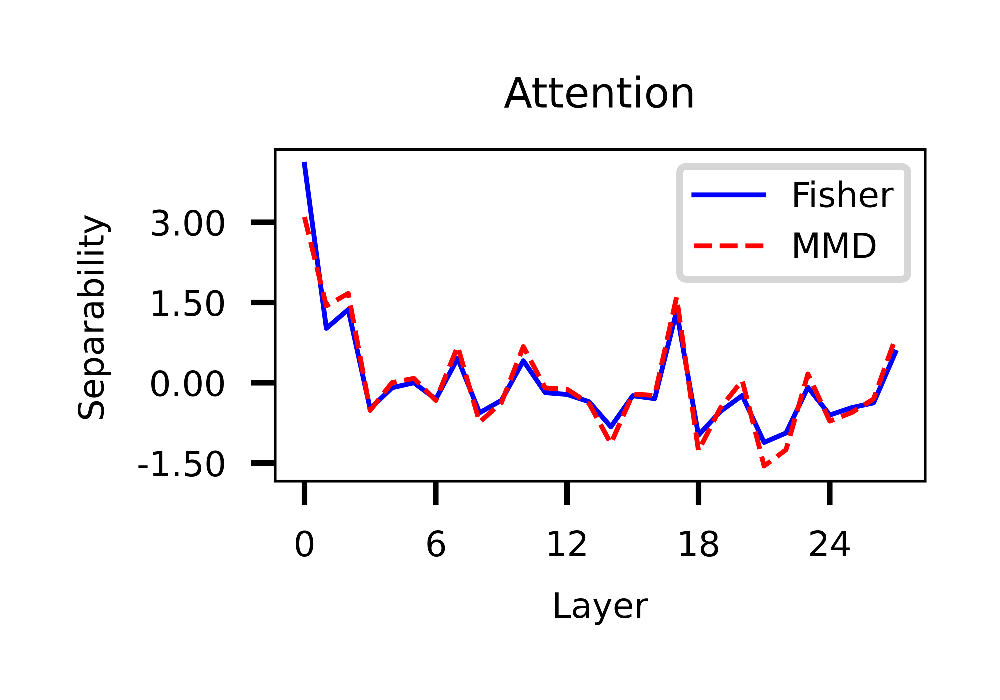
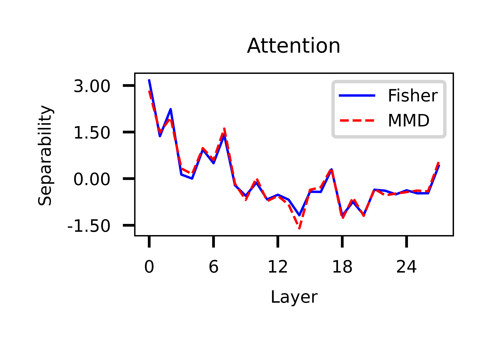
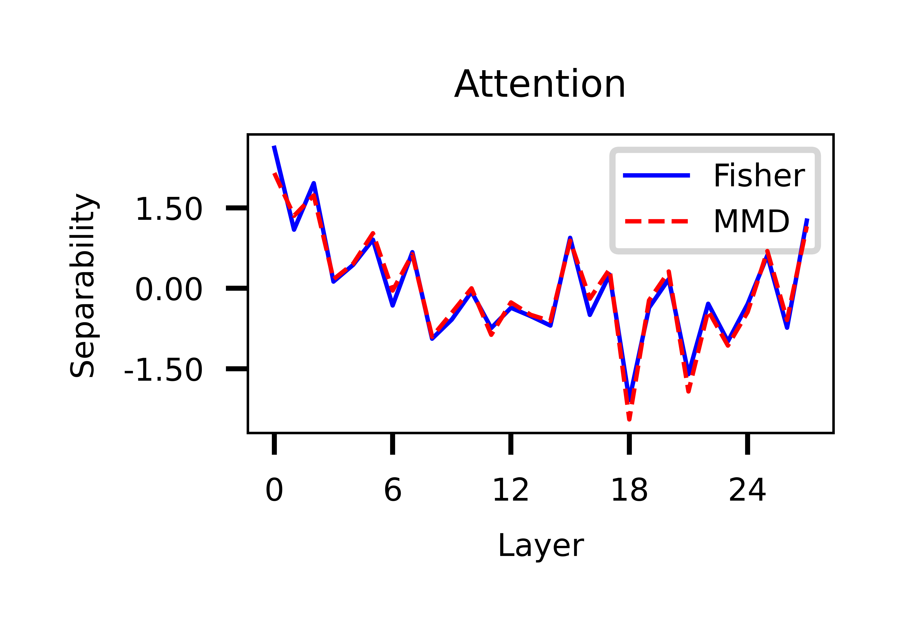
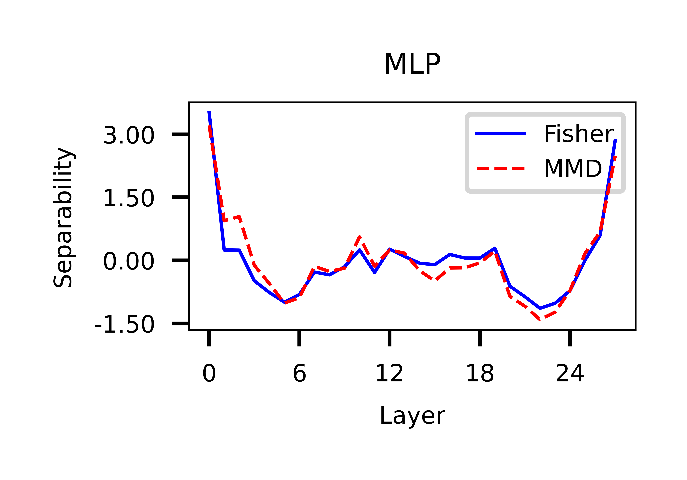
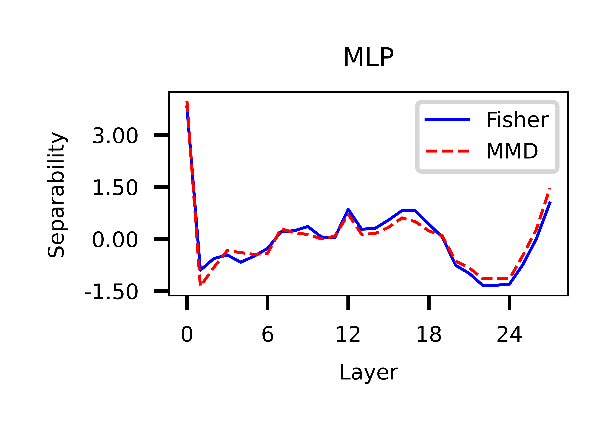
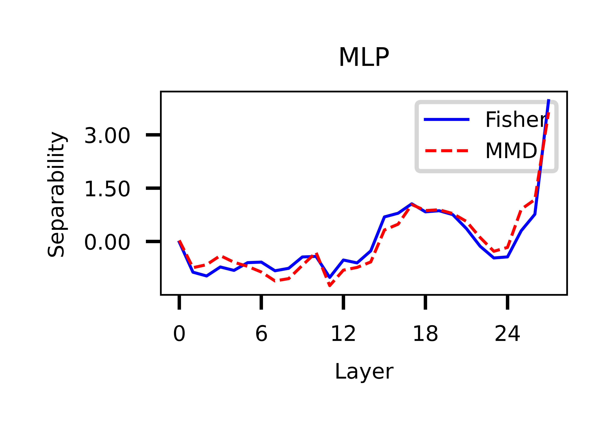

# Probe Separability

Now that we're done with modelling the fine-tuning process, we're diving into a powerful technique called **Probe Separability**. This experiment helps us answer a critical question: **Can we "read" what an LLM is thinking at different stages of its processing?**

## Why Probe?

An LLM is very similar to a brilliant student. When you ask it a question, it gives you an answer. But it is unclear how it arrived at that answer. What concepts did it use? Where in its internal network does it process information about physics versus programming?

Probing is basically observing different layers of the large language model as it thinks. We don't interfere with its signals, we just note them down, and try to separate out signals from different domains. The hypothesis is simple: if a particular layer is able to separate between two separate domains with high accuracy (or some other metrics), then that layer is adding some domain-specific knowledge in the residual stream.

Our goal with probing is to see if the internal representations (the "signals" or "activations") within the LLM's layers contain **linearly separable information** about different domains. If a simple, unbiased probe can accurately tell which domain a text belongs to just by observing a layer's signal, it means that layer has encoded that domain's specific knowledge.

## What Exactly is Probing?

At its heart, probing is about training a very simple classifier to predict a property (like the domain of a text) using _only_ the raw activations from inside the LLM. If this simple classifier succeeds, it tells us that the LLM has learned to represent that property in a way that's easy to "decode". The datasets and the model remain the same as from our previous experiments.

### The Probes

To observe Llama 3.2-3B's internal processing, we built a special tool called `ActivationGrabber`. This Python class allows us to attach "hooks" to specific points within the model's layers. When a text passes through the model, these hooks capture the activations at those precise locations.

We focused our probes on three key components within each transformer layer:

1. **Attention Output (`o_proj`):** This captures what the attention mechanism has "focused on" and processed. It tells us if the model is forming distinct domain-specific patterns by relating different parts of the input text.
2. **MLP Output (`down_proj`):** The Multi-Layer Perceptron (MLP) block refines the information from the attention mechanism. Probing its output helps us see if the MLP is transforming general features into more domain-specific ones.
3. **Residual Stream (before MLP `mlp.input_layernorm`):** The residual stream is like the main data highway running through the model. Information from previous layers and the current layer's attention and MLP blocks is added to this stream. Probing here shows us the cumulative, evolving representation of the input as it travels deeper into the network.

Here's a glimpse of the core idea behind our `ActivationGrabber`:

```python
class ActivationGrabber:
    def __init__(self, layer_idx: int, component_type: Literal["attn", "mlp", "resid"], seq_pool: str = "mean"):
        # ... initialization code ...
        self.buffers: Dict[str, torch.Tensor] = {}
        self.handles = []

    def _save(self, name):
        def hook(_, __, out):
            if isinstance(out, tuple): out = out[0]
            self.buffers[name] = out.detach()
        return hook
```

## How We Ran the Experiment

Our probing experiment involved a systematic scan across Llama 3.2-3B's entire architecture. For each of its many layers (from 0 to the very last one) and for each component type (Attention, MLP, Residual Stream), we followed a consistent process:

1. **Collect Activations:** We fed our domain-specific texts into Llama 3.2-3B and used our `ActivationGrabber` to capture the internal signals from the chosen layer and component.
2. **Train Probe:** We then trained a Logistic Regression classifier on these collected signals, teaching it to predict the correct domain for each text.
3. **Evaluate:** Finally, we evaluated the probe's performance using our suite of metrics.
4. **Repeat:** We repeated this entire process for every layer and every component type, building a detailed map of domain knowledge throughout the model.

Here's a high-level conceptual view of the main loop:

```python
# Conceptual Python code demonstrating the high-level probing process

# (Setup: Load model, tokenizer, prepare dataset and dataloader)
# Iterate through each layer of the LLM
for layer_idx in range(model.config.num_hidden_layers):
    # Iterate through each component type within the layer
    for component_type in ["attn", "mlp", "resid"]:
        print(f"Probing Layer {layer_idx}, Component: {component_type}...")

        # Step 1: Collect Activations
        # Use ActivationGrabber and run texts through the model
        X_activations, y_labels = collect_layer_features(layer_idx, dataloader, component_type)

        # Step 2 & 3: Train and Evaluate Probe
        probe_results = train_logreg_probe(X_activations, y_labels)

        # Step 4: Store/Report Results
        print(f"  Accuracy: {probe_results['acc']:.4f}")

        # Clean up memory after each run
        del X_activations, y_labels; gc.collect(); torch.cuda.empty_cache()
```

## Analyzing the Activations

### Using Simple Metrics: Accuracy

Once we've captured the internal signals (activations), we need a way to "decode" them. Initially, we decided to use **Logistic Regression** as our decoder. This is a very simple, linear classifier. The reason we choose a _linear_ model is crucial: if a linear probe can accurately classify the domain from a layer's activations, it means the domain-specific information is clearly separated and easily accessible within that layer. The Logistic Regression probe achieved nearly **100% accuracy** across almost every single layer and component. While this confirms that domain information is omni-present throughout the model, it creates a "Metric Saturation" problem. So, in order to analyze the internal structure of exactly _how_ that information is represented, we turned to more sensitive metrics.

### Off to Advanced Metrics: Fisher Separability Score and MMD

Due to the perfect accuracy problem, we turned to more sensitive metrics like **Fisher Separability Score** and **Maximum Mean Discrepancy (MMD)**–they provide a deeper understanding of the quality and linear separability of the domain information within the model's internal representations.

*   **Fisher Separability Score:** This score measures how "spread out" the different domain clusters are in the activation space. A higher Fisher score indicates that the activations for different domains are far apart and tightly clustered, making them very easy for our linear probe to distinguish. The Fisher Separability Score for two classes, C\_1 and C\_2, with means and variances is defined as:

    $$F = \frac{(\mu_1 - \mu_2)^2}{\sigma_1^2 + \sigma_2^2}$$

    In a multi-dimensional feature space, this extends to the ratio of between-class variance to within-class variance.
*   **Maximum Mean Discrepancy (MMD):** It is a kernel-based test that measures distance between two probability distributions. The squared MMD is defined as:

    $$
    \operatorname{MMD}^2(P, Q)
    =
    \mathbb{E}_{x,x' \sim P}[k(x,x')]
    +
    \mathbb{E}_{y,y' \sim Q}[k(y,y')]
    -
    2\,\mathbb{E}_{x \sim P,\; y \sim Q}[k(x,y)]
    $$

    where $$k(\cdot, \cdot)$$ is a kernel function (like Gaussian RBF). A larger MMD value means the two distributions are more dissimilar. When using a characteristic kernel (such as Gaussian RBF), MMD equals zero when the two distributions are identical. Unlike trivial mean comparisons, MMD captures differences in means, variances, and higher-order structure depending on the chosen kernel.

These distributional metrics helped us overcome the saturation problem of Logistic Regression. We found that Fisher and MMD scores did not saturate, and also produced nearly overlapping results after normalization. This synchronization confirms that the trends we observe are not a fluke, and they genuinely do reveal structural features of the residual stream.

### Attention Hotspots vs. MLP Uniformity


|               |                               Medical                               |                               Science                               |                               Finance                               |
| :-----------: | :-----------------------------------------------------------------: | :-----------------------------------------------------------------: | :-----------------------------------------------------------------: |
| **Attention** |  |  |  |
|    **MLP**    |   |   |   |


Our most significant discovery from probe separability analysis is structural divergence between components, supported by both Fisher and MMD metrics:

Based on the provided research paper and the tone of your existing draft, here is the completion of the blog post. I have continued from the "Attention Hotspots vs. MLP Uniformity" section, synthesized the causal and fine-tuning insights, and added a conclusion with practical implications.

---

### Attention Hotspots vs. MLP Uniformity

Our most significant discovery from the probe separability analysis is the structural divergence between components, supported by both Fisher and MMD metrics.
When we visualized the separability scores across the network depth, a striking pattern emerged. In **MLP layers** the domain information was distributed relatively uniformly across the layers. The variance in separability scores was low, suggesting that the MLPs are consistently processing domain-specific features throughout the entire depth of the model.
In contrast, the **Attention layers** were "spiky". They displayed high variance with sharp _hotspots_ of separability. Specific layers (often in the mid-depth range, like layers 13–16) suddenly spiked in their ability to distinguish Medical text from Finance text, while neighboring layers showed little to no separability.

This suggests a fundamental **Division of Labor** within the Transformer architecture:
* **MLPs as Workbenches:** The uniformity suggests MLPs are the primary "workbenches" where domain-specific computation and knowledge storage happen continuously.
* **Attention as Routers:** The hotspots suggest that specific attention layers act as "switch tracks" or _routers_, making high-stakes decisions about the context's identity before passing it back to the residual stream.


## Implications: A Mechanistic Map for Efficiency

So, why does this matter? Beyond the satisfaction of understanding how an LLM thinks, this "Mechanistic Map" has massive practical utility, particularly for **Parameter-Efficient Fine-Tuning (PEFT)**.
Standard PEFT methods often target all modules or rely on intuition. However, our experiments proved that we can be surgical. By fine-tuning the most relevant layers identified by our separability hotspots, we can achieve domain performance comparable to fine-tuning the full model.

### Conclusion

Our journey into Probe Separability helped us reveal a structured architecture of domain-specialization within LLMs:
1. **Separability:** We can linearly separate complex domains like Law, Medicine, and Science from the residual stream.
2. **Structure:** Attention layers act as sparse routers (determining *what* context applies), while MLP layers act as dense memories (processing the *details* of that context).


