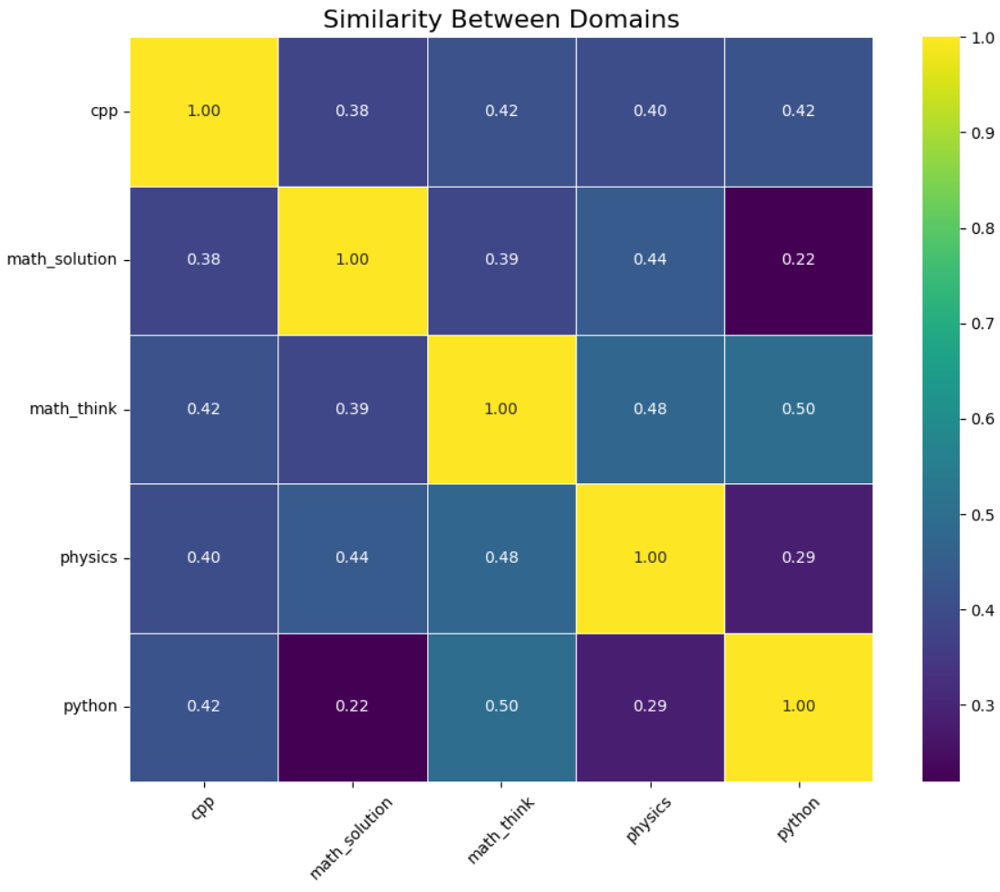

# Understanding COAR: Component Optimization via Ablation and Reconstruction

Imagine you have a large neural network , say a language model like Llama 3.2 3B and you want to understand what parts of it (i.e., which components) are responsible for a specific prediction. This is useful for debugging, editing, or improving model behavior.

Traditional attribution methods often focus on inputs (like saliency maps for pixels or tokens), but **COAR** dives into the **model's internals**. It asks:

> "Which internal components  neurons, attention heads, weight rows — matter most for a given prediction? What happens when we 'turn off' a small part of the network and observe how its output changes?"

In the last test (*The Hydra Effect*), we zeroed out outputs and measured the difference in logits. COAR goes one step further by training a **linear regressor** which assigns weights to components, indicating their contribution to the change in output. This enables deeper analysis of specific components’ roles in prediction.

This method is called **COAR**  *Component Optimization via Ablation and Reconstruction*.

## 1.COAR Pipeline

The COAR procedure involves the following steps:

1. Define components  
2. Apply ablations (zeroing out components)  
3. Observe the resulting change in output  
4. Learn a linear model to predict changes  

## 2.Theoretical Foundation

### 2.1 Supervised Learning Setup

First of all as COAR is a general methodology , let us consider a simplified supervised learning setup for any discriminative ML model :

$$
S = \{ z_i = (x_i, y_i) \}_{i=1}^n
$$

Let $M$ be a trained model (whose internal working we want to know) and \( f_M(z) \in \mathbb{R} \) be a statistic measuring correctness on example \text{z} — such as:

- Cross-entropy loss (for classification task)
- Mean Squared error (for regression task)
- Margin between correct and highest incorrect class logit (for generative models , more information ahead)

Now in our case , we want to analyze LLama 3.2 3B model , a generative model, then how do we define a statistic for measuring the correctness of an example?

We do **next-token prediction** in LLama 3.2 3B model, framed as a $v$-way classification problem, where $v$ is the vocabulary size and therefore the model output function is defined as the **average correct-class margin** over a sequence:

$$
f_M(z) = \frac{1}{T} \sum_{t=1}^T \left( \text{logit}_{\text{true}_t} - \max_{j \neq \text{true}_t} \text{logit}_j \right)
$$

Where $T$ is the number of tokens in the sequence.

### 2.2 Modeling Internals with a Computation Graph
Once we have a dataset for our model to be trained on we define componenets which determine with what granualarity we have to ablate the models , in simple words it's just the parts of the model $M& in which we are interested 
> "What would ablating this particular part of the model change the output , such set of parts is components. "

We do not treat $M$ as a black box, but as a **computation graph** $G_M$, with nodes representing internal **components** and the definition of components is in our hands that is :

For a linear model:  
- Each component $C_i(z) = w_i \cdot x_i$  
- Output is $\sum_i C_i(z)$

For complex models like Transformers, components may be:
- Entire layers or submodules
- Attention heads
- Feed-forward blocks
- Individual parameters

Or if we want to do a finer analysis then we can define components as the rows of a particular Key , Query , Value , up projection etc matrices .

In our study we wanted to study about the layers of LLMs that how ablating a layer would affect the output or if framed in better words it can be said as which layer would consist of the knowledge about a particular domain is what we want to find.

Therefore we defined our components as each weight matrix(total number of components came out to be 196 for Llama 3.2 3B model) in all the layers which roughly but in a more sofisticated manner divided our model into layer componenets.

### 2.3 Component Modeling Objective

Now comes the ablation part , now that we have defined the components and we have a dataset,
We define the **component counterfactual function**:

$$
f_M(z, C') := \text{model output on } z \text{ after ablating components } C' \subseteq C \tag{1}
$$
That is simply what is the output of the model on an example $ z = (x, y) $ when we **ablate** $ C'$ components out of $C$.
**Ablation** here means setting weights of selected components to zero.

So in our case we randomly set some $\alpha_{\text{train}}$ percent (3 percent in our case) of total components of the weight matrices to 0 and then pass the examples $z$ and record the change in output.

### 2.4 Ablation Vector
> "How are we representing the model components and how do we know which components are zeroed(ablated) ?"

For answering the above question we defince ablation more formally as:

Let $C = \{c_1, \dots, c_N\}$ be the components. The ablation vector $\mathbf{0}_{C'} \in \{0,1\}^N$ is defined by:

$$
(\mathbf{0}_{C'})_i = 
\begin{cases}
0 & \text{if } c_i \in C' \\
1 & \text{otherwise}
\end{cases}
$$

Which is simply an ablation mask ,  that is if a component is in $C'$ set of components ($C'$ is the set of componenets out of the total components which we want to ablate) then consider that component as 0 , otherwise keep it 1.

### 2.5 Component Attribution
One last definition we have to define is of a simple linear model $g^{(z)}$ that approximates $f_M(z, C')$:

$$
g^{(z)}(\mathbf{0}_{C'}) = \mathbf{0}_{C'}^\top \cdot \mathbf{w}^{(z)} + b^{(z)} \tag{2}
$$

Here:
- $\mathbf{w}^{(z)}$ is a learned attribution vector
- $b^{(z)}$ is a bias term
- $g^{(z)}$ approximates the counterfactual output

## 3. COAR Algorithm Steps

### 3.1 Construct Component Dataset

In simple terms the dataset for the linear regressor can be defined as 
* The component mask can be seen as X (input features).
* The value output difference of an example measured via some statistic as defined earliner can be seen as Y (output feature).

Writing the same thing but in the terms that we defined above:
For a given input $z$ we construct a dataset of component ablations:

$$
\mathcal{D}^{(z)} := \left\{ (C_1, f_M(z, C_1)), \dots, (C_m, f_M(z, C_m)) \right\} \tag{3}
$$

- Each $C_i$ is a random subset of components of size $\alpha_{\text{train}} \cdot |C|$
- $f_M(z, C_i)$ is the counterfactual output

where $\alpha_{\text{train}}$ is the percentage of components ablated.

In our experiments we had 5 such datasets corresponding to 5 domains , namely C++ , python , mathematics-think , mathematics-reason and physics.

The image below gives an idea of how a particular training dataset for a linear regressor in out case would look like

### 3.2 Fit Linear Estimator

Now with a dataset of component masks and the output difference, we fit a linear regressor which was defined earlier on the dataset , solving the problem :

$$
\min_{\mathbf{w}, b} \sum_{(C_i, f_M(z, C_i)) \in \mathcal{D}^{(z)}} \left( \mathbf{0}_{C_i}^\top \cdot \mathbf{w} + b - f_M(z, C_i) \right)^2 \tag{4}
$$

Then define:

$$
g^{(z)}(\mathbf{0}_{C'}) := \mathbf{0}_{C'}^\top \cdot \mathbf{w}^{(z)} + b^{(z)} \tag{5}
$$

Now since the model the model outputs the output difference and the way we defined the components , each of the cofficient of the components correspond to the value of how much that component affects the output.

To understand this let's take an example,
Suppose we there is an LLM on which we trained this regressor after following all the steps , now for some example containing information of mathematics , the weight which got assigned to layer 2 MLP_up_projection matrix was much higher than what was assigned to layer 3 attention_query matrix component then that implies that layer 2 MLP_up_projection matrix had a higher influence in depriciating the output when ablated than the layer 3 attention query matrix.

## 4 Evaluate Attribution Accuracy

### 4.1 Correlation between predictions
Now to confirm if the predictions we are giving or the analysis which we are doing is correct we do a simple correlation text , we use unseen subsets $C'_i$ to evaluate generalization:

$$
\mathcal{D}_{\text{test}}^{(z)} = \{ C'_1, \dots, C'_k \}, \quad C'_i \sim \text{Uniform}\left(\{ C' \subset C : |C'| = \alpha_{\text{test}}|C| \}\right)
$$

Measure **Pearson correlation** between predictions and ground-truth:

$$
\rho^{(z)} := \text{Pearson-}\rho \left(
\{ f_M(z, C'_i) \}_{i=1}^k,
\{ g^{(z)}(\mathbf{0}_{C'_i}) \}_{i=1}^k
\right) \tag{6}
$$

We got a whooping 98 percent correlation between our predicted margins and the predicted margins , indicating the reliability of the analysis.

### 4.2 Dataset Splitting: Consistency of Attributions Across Random Splits

To test the **robustness and reproducibility** of COAR component attributions, we designed an experiment involving **splitting the dataset** into two independent subsets and performing COAR on each.

#### 4.2.1 Experimental Setup

- We randomly split our dataset into **two disjoint parts**, say $\mathcal{D}_1$ and $\mathcal{D}_2$.
- For each split:
  - We applied the standard COAR pipeline (random ablations, counterfactual evaluation, linear model fitting).
  - This gave us two sets of attribution vectors: $\theta^{(z)}_1$ and $\theta^{(z)}_2$.

#### 4.2.2 Initial Hypothesis

We **expected** that since the underlying model and ablation process were the same, the component attributions $\theta^{(z)}_1$ and $\theta^{(z)}_2$ would be **highly similar** .

> In theory, different data samples should yield consistent attributions **if** the signal learned by the linear regressor is strong and components are independently causal.

But things don't go always as planned , the results **contradicted our expectations**:

- The component weights $\theta^{(z)}_1$ and $\theta^{(z)}_2$ turned out to be **surprisingly different**.
- This raised an important question:  
  > “Why do two splits of the same dataset, processed using the same method, yield inconsistent attributions?”

Just as we were puzzled.....

On reflection, we realized the issue lay in the **random ablations** used to construct the component datasets:

- Suppose in split 1, the ablation subset was $\{1, 3, 6\}$  
- And in split 2, it was $\{1, 6, 8\}$

Even though components 1 and 6 appear in both, the **context of ablation** i.e., the other components they're grouped with changes their influence on the output due to **component interactions**.
This is because **component effects are not strictly independent**; they interact in non-linear ways within the model's forward pass.

Now we then tested a new hypothesis:
> If we apply the **same set of ablation masks** to both splits (i.e., same $\{C_1, C_2, \dots, C_m\}$ used for dataset construction), then the learned attribution vectors should match.

And **boom** they did.

For all the datasets we got exact overlapping or almost overlapping graphs

- When using **identical ablation sets** across both halves of the data, the resulting component attributions were **highly aligned** (quantitatively ).
- This confirmed that the inconsistency was due to **variability in random ablation masks**, not the data distribution or the model itself.
- Therefore we can say that the analysis which we are going to do is correct and we are able to extract the the components in which domain knowledge is stored.
- This also reinforces the importance of considering **component dependencies** when interpreting attribution values , what matters is not just **which component** is ablated, but also **with whom**.

## 5. Results
Now that we have proved that our experiments are valid and can give reliable outcomes , here are the list of results we derived from this section.

### 5.1 Domain-wise layer importance
We just plot average weight per layer across domains which can imply what layers are helping in predicting things around a particular domain:

### 5.2 Similarity between components
Since we had 5 domain datasets , we have 5 linear regressors corresponding to each of the domain datasets , each of whose weights ,  in simple terms , represent the importance of those components who were responsible for predicting the output of that particular domain. So according to that if weights of a linear regressor trained on python codes dataset much show more similarity with dataset of C++ codes than physics , keeping this mind we plot the similarity between trained weights for all the datasets we have trained upon:

You must be thinking then why is there a good similarity between maths_think and python? We hypothesize that the most important layers which we got from maths_think dataset represent the logical reasoning ability of the model and therefore all our datasets being reasoning related we are getting a good similarity between them , whereas maths_solution dataset is more oriented towards writing the solution and hence very low logical reasoning required therefore giving a low similarity with python.

### 5.3 Maths-think v/s Maths-solution
This is something interesting we stumbled upon , if we plot maths-think regressor weights and maths-solution regressor weights on one graph , we see that for some layers the value of weights was same but for some it was different , we hypothesize that some layers which contributed to mathematical knowledge of the model were same in both the cases but the other layers which came out to be different were more oriented towards logical thinking and solution writing for maths_think and maths_solution respectively.

