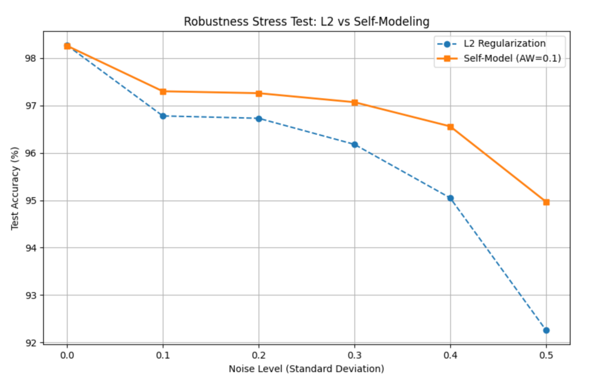

# Self Modelling

## Objective

This work explores whether the auxiliary task of predicting internal states influences the complexity of learned representations.

Inspired by observations in _Unexpected Benefits of Self-Modeling in Neural Systems_ (Premakumar et al., 2024), we examine if self-modeling acts as a form of implicit regularization. We empirically compare a self-modeling MLP against standard L2 regularization and reconstruction-based baselines on MNIST, focusing on changes in the Real Log Canonical Threshold (RLCT) and effective dimensionality.

***

## Methodology

We trained a standard MLP (single hidden layer, 512 nodes) on MNIST. To isolate the regularization effect, we introduced a joint loss function combining classification accuracy and internal state prediction:

$$
L_{total} = L_{class} + \lambda L_{self}
$$

* **$L\_{class}$**: Standard cross-entropy loss.
* **$L\_{self}$**: MSE between the _predicted_ and _actual_ hidden layer activations.
* **$\lambda$**: Auxiliary weight (optimal $\lambda=0.1$).

**Baselines:**

1. **Unregularized:** Standard training.
2. **L2 Regularization:** Weight decay ($1e^{-3}$).
3. **Reconstruction (MTL):** Auto-encoding auxiliary task (input reconstruction) rather than self-prediction.

***

## Results and Discussion

### RLCT Analysis: Effective Complexity

Despite similar validation accuracy across all models (\~94.8%), the internal geometry of the solutions differed significantly. We estimated the **Real Log Canonical Threshold (RLCT)** via Stochastic Gradient Langevin Dynamics (SGLD). Lower RLCT values indicate a lower "effective dimension" of the singular posterior, effectively a proxy for a simpler solution basin.

The Self-Model achieved a significantly lower RLCT, effectively pruning complexity without explicit weight decay.

| Model                    | Init Loss | SGLD Loss | RLCT ($\lambda$) | Effective Params |
| ------------------------ | --------- | --------- | ---------------- | ---------------- |
| **Unregularized**        | 0.17      | 0.42      | 1382.5           | 2765.1           |
| **L2 Regularized**       | 0.18      | 0.42      | 1337.9           | 2675.7           |
| **Self-Model**           | 0.19      | 0.39      | **1113.4**       | **2226.8**       |
| **Reconstruction (MTL)** | 0.19      | 0.43      | 1298.3           | 2596.7           |

The Self-Model reduced effective complexity by \~17% compared to L2 regularization. This reduction correlates with increased sparsity: the Self-Model drove **\~48%** of neurons to zero activation (dead neurons), compared to \~38% in baselines. The network effectively pruned itself to become "modelable."

### Robustness Under Stress

We evaluated noise resilience by injecting Gaussian perturbations. The Self-Model maintained accuracy significantly longer than the L2 baseline, indicating a flatter local minimum.

### Conclusion

Self-prediction acts as a structural constraint. By requiring internal states to be predictable, the optimizer avoids sharp, high-complexity minima. The result is a network that is not just statistically accurate, but mechanically simpler and more robust to perturbation.
