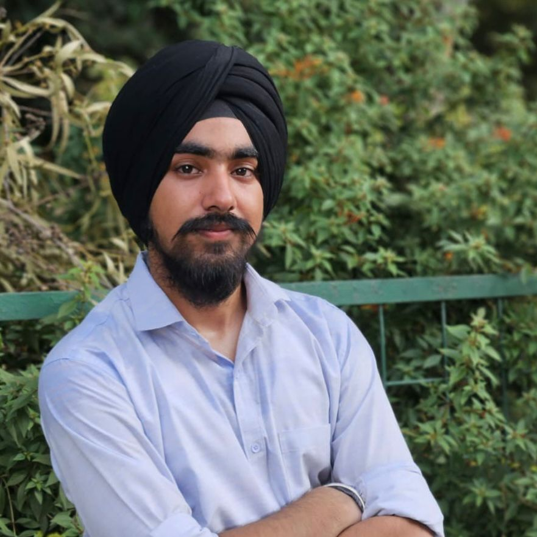
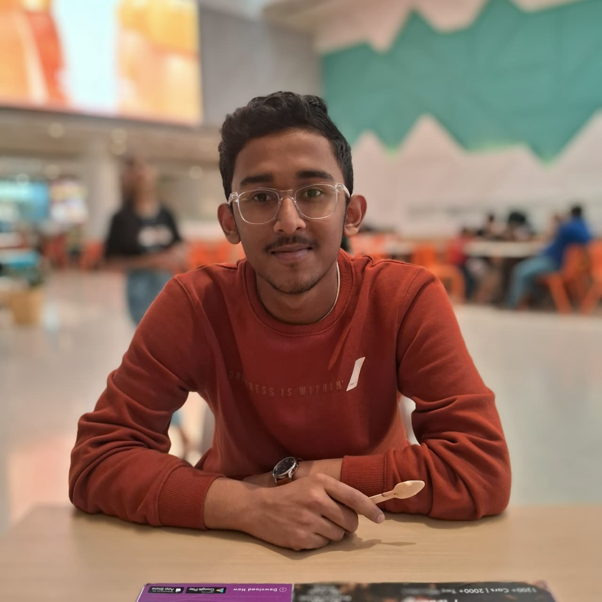

<h1 align='center'>The Team</h1>

  

    
    <h3>Kaustubh Sharma</h3>
    

      Electrical Engg. (2027) 
      <a href="#">GitHub</a> | <a href="#">Website</a> 
      <a href="mailto:kaustubhdadhich@gmail.com">Email</a>
    

  

  

    
    <h3>Manjot Singh</h3>
    

      Computer Science Engg. (2028) 
      <a href="#">GitHub</a> | <a href="#">Website</a> 
      <a href="mailto:mithugunnu2006@gmail.com">Email</a>
    

  

  

    
    <h3>Aditya Chauhan</h3>
    

      Data Science and AI (2028) 
      <a href="#">GitHub</a> | <a href="#">LinkedIn</a> 
      <a href="mailto:mithugunnu2006@gmail.com">Email</a>
    

  

  

