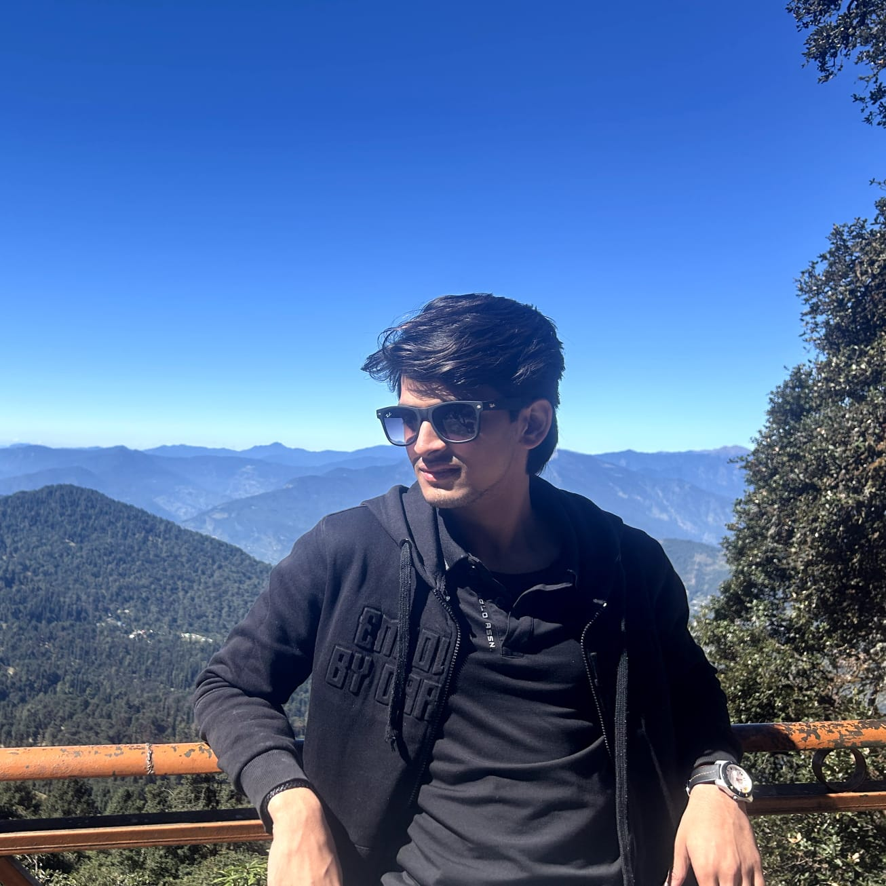
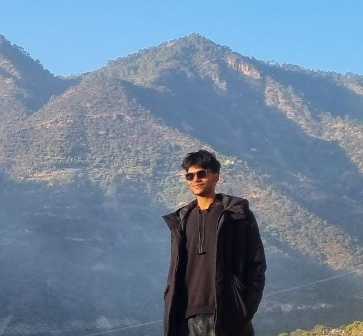
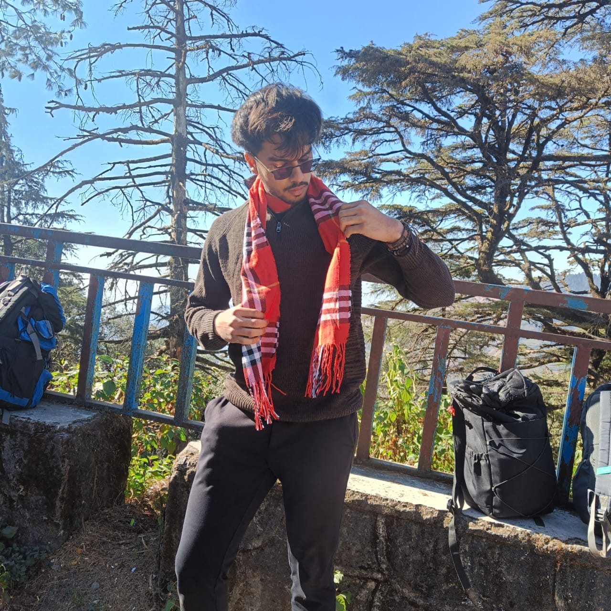

# The Team

<table style="width: 100%; border-style: none; border-collapse: collapse;">
  <tr>
    <td width="50%" style="border: none; text-align: center; vertical-align: top;">
      
      <h3>Kaustubh Sharma</h3>
      

        Electrical Engg. (2027) 
        <a href="https://github.com/kaustubh202">GitHub</a> | <a href="https://kaustubh202.github.io/">Website</a> 
        <a href="mailto:kaustubhdadhich@gmail.com">Email</a>
      

    </td>
    <td width="50%" style="border: none; text-align: center; vertical-align: top;">
      
      <h3>Manjot Singh</h3>
      

        Computer Science Engg. (2028) 
        <a href="https://github.com/ManjotSingh08x">GitHub</a> | <a href="https://manjotsingh08x.github.io/">Website</a> | <a href="https://www.linkedin.com/in/manjot-singh-1b670326b/"> LinkedIn </a> 
        <a href="mailto:mithugunnu2006@gmail.com">Email</a>
      

    </td>
  </tr>
  <tr>
    <td width="50%" style="border: none; text-align: center; vertical-align: top;">
      
      <h3>Aditya Chauhan</h3>
      

        Data Science and AI (2028) 
        <a href="https://github.com/cerussite0">GitHub</a> | <a href="https://www.linkedin.com/in/aditya-chauhan-16560b33a/">LinkedIn</a> 
        <a href="mailto:name.adityachauhan@gmail.com">Email</a>
      

    </td>
    <td width="50%" style="border: none; text-align: center; vertical-align: top;">
      
      <h3>Akshat Tomar</h3>
      

        Data Science and AI (2028) 
        <a href="https://github.com/AkshatT2307">GitHub</a> | <a href="https://www.linkedin.com/in/akshat-t?utm_source=share&utm_campaign=share_via&utm_content=profile&utm_medium=android_app">LinkedIn</a> 
        <a href="mailto:akshat.tomar1234@gmail.com">Email</a>
      

    </td>
  </tr>
    <tr>
    <td width="50%" style="border: none; text-align: center; vertical-align: top;">
      
      <h3>Srijan Tiwari</h3>
      

        Electrical Engg. (2028) 
        <a href="https://github.com/frisco137">GitHub</a> | <a href="https://www.linkedin.com/in/srijan137/">LinkedIn</a> 
        <a href="srijanvinodtiwari@gmail.com">Email</a>
      

    </td>
    <td width="50%" style="border: none; text-align: center; vertical-align: top;">
      
      <h3>Ojasva Nema</h3>
      

        Metallurgy Engg. (2027) 
        <a href="https://github.com/ojasvanema">GitHub</a> | <a href="http://www.linkedin.com/in/ojasva-nema">LinkedIn</a> 
        <a href="mailto:ojasva098@gmail.com">Email</a>
      

    </td>
  </tr>
  <tr>
    <td width="50%" style="border: none; text-align: center; vertical-align: top;">
      
      <h3>Abhiraj Bharangar</h3>
      

        Computer Science Engg. (2028) 
        <a href="https://github.com/Always-Exploring-exe">GitHub</a> | <a href="https://www.linkedin.com/in/aditya-chauhan-16560b33a/">LinkedIn</a> 
        <a href="mailto:ayushbharangar@gmail.com">Email</a>
      

    </td>
    <td width="50%" style="border: none; text-align: center; vertical-align: top;">
    </td>
  </tr>
</table>
